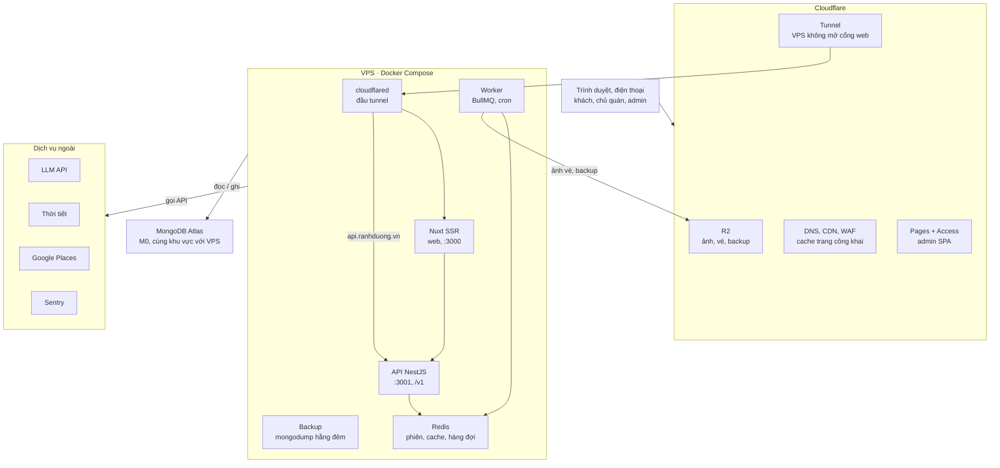
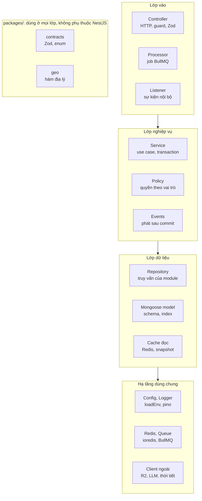
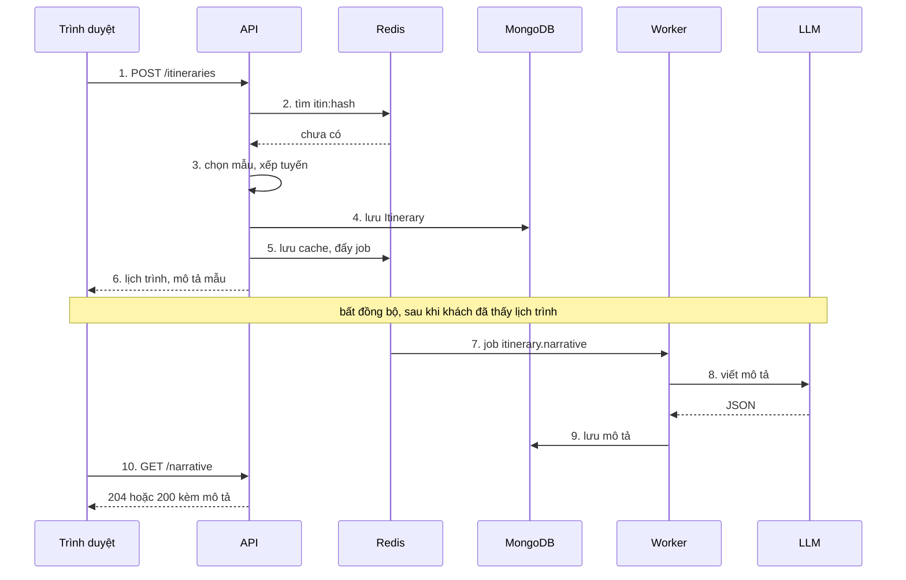

# Kiến trúc hệ thống: Rành Đường

6/10/2026 · @Manh Tri

## 1. Tổng quan và nguyên tắc

Tài liệu này mô tả hệ thống được ghép như thế nào: chạy ở đâu, request đi qua đâu, các module nói chuyện với nhau ra sao, và sẽ mở rộng thế nào. Chi tiết data model, API, thuật toán nằm ở [Thiết kế kỹ thuật: Cẩm nang số Đà Lạt (MVP)](technical-design.md); phạm vi sản phẩm ở [Spec sản phẩm: Cẩm nang số Đà Lạt (MVP)](product-spec.md); giao diện ở [Spec UI: Rành Đường](ui-spec.md).

**Nguyên tắc kiến trúc:**

1. **Monolith có module, không microservice.** Một API NestJS duy nhất, chia module theo nghiệp vụ; worker chạy cùng codebase ở tiến trình riêng. Một người vận hành được, tách dịch vụ chỉ khi có số liệu chứng minh cần.
2. **API không giữ trạng thái.** Phiên, cache, hàng đợi, rate limit nằm ở Redis; dữ liệu ở MongoDB; ảnh ở R2. Nhờ vậy chạy thêm instance API chỉ là chạy thêm container.
3. **Việc chậm hoặc định kỳ đi qua hàng đợi.** Request của khách chỉ làm việc nhanh (dưới 300 ms); gọi LLM, sinh ảnh, tổng hợp số liệu, gọi dịch vụ ngoài chạy trong worker.
4. **Dữ liệu tự curate là nguồn sự thật.** Dịch vụ ngoài (Google, thời tiết, LLM) chỉ bổ trợ; lỗi của chúng không được làm hỏng trang.
5. **Đọc nhiều, ghi ít.** Trang công khai render SSR và cache ở Cloudflare; API đọc có cache Redis; ghi luôn đi thẳng vào MongoDB với thao tác nguyên tử.
6. **Mọi thứ có `cityId`.** Thêm thành phố là thêm dữ liệu và cấu hình, không đổi kiến trúc.
7. **Rẻ trước, nâng cấp theo số liệu.** Bắt đầu với một VPS và gói miễn phí; mỗi bước nâng cấp ở mục 9 có ngưỡng kích hoạt rõ ràng.

## 2. Sơ đồ triển khai

Ở MVP, toàn bộ phần tự chạy nằm trên một VPS dùng Docker Compose, đứng sau Cloudflare; dữ liệu chính ở MongoDB Atlas, ảnh và bản backup ở R2.

*Một VPS sau Cloudflare, dữ liệu nằm ở Atlas và R2.*



**Container trên VPS:**

| Container | Vai trò | Ghi chú |
| --- | --- | --- |
| `cloudflared` | Đầu Cloudflare Tunnel, chuyển `ranhduong.vn` sang `web`, `api.ranhduong.vn` sang `api` | VPS chỉ mở cổng SSH |
| `web` | Nuxt SSR (Node), chỉ web cho khách | Gọi API qua `http://api:3001` |
| `api` | NestJS, entrypoint HTTP | Không giữ trạng thái, chạy thêm bản sao được |
| `worker` | NestJS, entrypoint worker: BullMQ, cron (rollup, nhắc xác minh, backup) | Cùng image với `api`, khác lệnh chạy |
| `redis` | Phiên, cache, rate limit, hàng đợi | Bật AOF để không mất hàng đợi khi khởi động lại |

**Admin tách riêng ngay từ đầu:** SPA Vue 3 + Vite (`apps/admin`) build ra file tĩnh, deploy lên Cloudflare Pages tại `admin.ranhduong.vn`, đặt sau Cloudflare Access để chỉ email được phép mới tải được trang. Admin gọi `api.ranhduong.vn` với cookie phiên ở `.ranhduong.vn`; API bật CORS có `credentials` cho đúng hai nguồn `https://ranhduong.vn` và `https://admin.ranhduong.vn`, và kiểm `Origin` theo cùng danh sách. Trang chủ quán sau này cũng theo cách này. VPS chỉ còn phục vụ web khách, API và worker.

Mọi container `restart: unless-stopped`, giới hạn RAM, log xoay vòng. Staging chạy trên cùng VPS bằng một Compose project riêng, subdomain `staging.`, dùng cluster Atlas riêng.

**Triển khai:** GitHub Actions build image (`web`, `api` dùng cho cả `api` và `worker`), đẩy lên GitHub Container Registry; VPS kéo image mới và chạy `docker compose up -d` qua SSH. Merge vào `main` tự triển khai staging; tag `v*` triển khai production. App admin build tĩnh và deploy lên Cloudflare Pages (nhánh main ra bản xem trước, tag v\* ra production). Bản đồ lấy tile thẳng từ OpenFreeMap nên không đi qua VPS.

## 3. Đường đi của request

Mọi traffic vào qua Cloudflare; VPS không mở cổng web ra Internet mà nhận request qua Cloudflare Tunnel. Nuxt gọi API qua mạng nội bộ Docker, không đi vòng ra ngoài.

**Tên miền:** `ranhduong.vn` cho web, `api.ranhduong.vn` cho API, `media.ranhduong.vn` cho ảnh trên R2. Cookie phiên đặt ở `.ranhduong.vn` để web và API dùng chung.

| Loại request | Đường đi | Cache |
| --- | --- | --- |
| Trang công khai (`/da-lat`, trang địa điểm, lịch trình mẫu) | Trình duyệt → Cloudflare → Tunnel → Nuxt SSR → API nội bộ (`http://api:3001`) → Redis / MongoDB | Cloudflare theo `routeRules` (SWR 1 giờ đến 1 ngày); API đọc qua cache Redis |
| Gọi API từ trình duyệt (tạo lịch trình, check-in, nhận voucher) | Trình duyệt → Cloudflare → Tunnel → API | Không cache ở Cloudflare; rate limit ở API (Redis) |
| Trang quản trị `admin.ranhduong.vn` | Trình duyệt → Cloudflare Access (xác minh email) → Cloudflare Pages (file tĩnh); gọi API tới api.ranhduong.vn qua Tunnel, kèm cookie | Không cache |
| Ảnh | Trình duyệt → `media.ranhduong.vn` (bucket R2 công khai qua Cloudflare) | Cache dài ở Cloudflare, tên file có hash nên không cần xoá cache |
| Upload ảnh | Trình duyệt xin presigned URL từ API → upload thẳng lên R2 → worker kiểm tra và tạo các kích thước | Không đi qua API, đỡ băng thông VPS |
| Bản đồ | Style JSON từ `ranhduong.vn`; tile từ OpenFreeMap | Trình duyệt và Cloudflare cache |
| Gọi dịch vụ ngoài | Chỉ từ API hoặc worker: thời tiết, LLM, Google (lấy `place_id`) | Kết quả cache trong Redis (mục 7) |

**Khi sửa dữ liệu:** địa điểm, lịch trình hay danh sách thay đổi thì worker gọi Cloudflare API xoá cache đúng các URL liên quan (trang địa điểm, trang danh mục, sitemap), không xoá toàn bộ.

## 4. Kiến trúc bên trong NestJS

Mỗi module nghiệp vụ có cùng bốn lớp, phụ thuộc chỉ đi một chiều từ trên xuống; module chỉ chạm vào collection của chính nó.

*Request đi một chiều từ lớp vào xuống hạ tầng.*



**Cấu trúc thư mục một module (ví dụ `places`):**

```text
apps/api/src/modules/places/
  places.module.ts        khai báo, export PlacesService
  places.controller.ts    lớp vào: route, guard, validate bằng schema trong packages/contracts
  places.service.ts       lớp nghiệp vụ: use case, transaction, phát sự kiện
  places.policy.ts        ai được làm gì với địa điểm nào
  places.repository.ts    lớp dữ liệu: mọi truy vấn MongoDB của module
  schemas/place.schema.ts Mongoose schema và index
  places.listener.ts      nghe sự kiện của module khác (nếu có)
  places.processor.ts     xử lý job của module (nếu có)
  *.spec.ts               test cạnh file
```

**Quy tắc:**

- Controller, processor, listener chỉ gọi service; không chứa logic nghiệp vụ, không gọi repository.
- Chỉ repository import Mongoose model. Module khác muốn dữ liệu địa điểm phải gọi `PlacesService` được export, không đọc thẳng collection `places`.
- Transaction mở và đóng ở service; repository nhận `session` khi được truyền vào.
- Kiểu dữ liệu qua ranh giới module là DTO trong `packages/contracts`, không phải document Mongoose.
- Phụ thuộc giữa module chỉ đi một chiều; cần gọi ngược thì dùng sự kiện (mục 5). Không dùng `forwardRef` để vá vòng phụ thuộc.

**Thứ tự phụ thuộc giữa module (được gọi xuống dưới, không gọi ngược lên):**

| Tầng | Module | Được gọi service của |
| --- | --- | --- |
| Nền | cities, users, media | Không module nghiệp vụ nào |
| Lõi | places, points | Tầng nền |
| Nghiệp vụ | submissions, claims, vouchers, rewards, itineraries | Tầng nền và lõi |
| Ngoài cùng | auth, metrics, admin | Mọi tầng dưới |

## 5. Giao tiếp giữa module

Có ba cách, chọn theo mức độ ràng buộc: gọi service trực tiếp khi cần kết quả ngay và phải cùng thành công; phát sự kiện nội bộ cho việc phụ phải xảy ra sau; đẩy job vào hàng đợi cho việc chậm hoặc gọi dịch vụ ngoài.

| Cách | Dùng khi | Ví dụ |
| --- | --- | --- |
| Gọi service được export | Cần kết quả ngay, hoặc phải nằm chung một transaction | Duyệt đóng góp: `submissions` gọi `places.applyChange()` và `points.award()` trong cùng transaction |
| Sự kiện nội bộ (`@nestjs/event-emitter`, cùng tiến trình) | Việc phụ, có thể làm sau, lỗi không được làm hỏng thao tác chính | Địa điểm đổi trạng thái → xoá cache lịch trình |
| Hàng đợi BullMQ (sang worker) | Việc chậm, gọi dịch vụ ngoài, cần retry | Viết mô tả lịch trình bằng LLM, sinh ảnh vé, xoá cache Cloudflare |

**Danh sách sự kiện:**

| Sự kiện | Phát từ | Ai nghe | Làm gì |
| --- | --- | --- | --- |
| `place.updated` | places | itineraries, metrics, jobs | Xoá cache lịch trình chứa điểm đó; đẩy job xoá cache Cloudflare |
| `place.statusChanged` | places | itineraries, places (snapshot) | Làm mới snapshot địa điểm trong bộ nhớ; xoá cache lịch trình |
| `submission.approved` | submissions | metrics, users | Tăng `approvedCount`, xét nâng cấp uy tín |
| `checkin.created` | points | rewards, metrics | Xét quà cột mốc; tăng `place_metrics.checkins` |
| `itinerary.created` | itineraries | jobs, metrics | Đẩy job viết mô tả; tăng `inItineraries` cho các địa điểm |
| `voucher.redeemed` | vouchers | metrics | Tăng `voucherUses` |
| `user.loggedIn` | auth | users | Gộp ID khách tạm |

**Quy tắc:**

- Sự kiện chỉ phát **sau khi** transaction đã commit, để người nghe không xử lý dữ liệu bị huỷ.
- Việc liên quan đến điểm, voucher, tiền: không dựa vào sự kiện, phải nằm trong transaction của thao tác chính.
- Người nghe sự kiện phải idempotent và tự bắt lỗi của mình; lỗi chỉ ghi log và Sentry, không ném ngược lại.
- Tên sự kiện dạng `<module>.<việc đã xảy ra>` ở thì quá khứ; payload chỉ chứa ID và trường cần thiết, khai báo kiểu trong `packages/contracts`.

## 6. Luồng chính

Bốn luồng quan trọng nhất của hệ thống; chi tiết từng bước và mã lỗi nằm ở thiết kế kỹ thuật mục 5–8.

**Tạo lịch trình:** phần khách chờ chỉ gồm cache, thuật toán trong bộ nhớ và một lần ghi MongoDB; viết mô tả bằng LLM chạy sau trong worker.

*Khách nhận lịch trình ngay, mô tả LLM đến sau.*



Khi cache có sẵn (bước 2 tìm thấy), API chỉ tạo bản `Itinerary` mới cho khách và trả về ngay. LLM lỗi hoặc quá 8 giây thì web giữ mô tả mẫu.

**Check-in:**

1. Trình duyệt gửi toạ độ, sai số GPS, ảnh (đã upload lên R2) kèm `Idempotency-Key`.
2. API kiểm rate limit (Redis), sai số GPS, khoảng cách bằng `$near` (MongoDB).
3. Trong một transaction: ghi `Checkin` (unique index chặn lần thứ hai trong ngày) và `PointTx`.
4. Sau commit: phát `checkin.created`; listener của `rewards` xét quà cột mốc, `metrics` tăng bộ đếm Redis; cập nhật bảng xếp hạng (`ZINCRBY`).
5. Trả về điểm vừa cộng và quà (nếu có).

**Nhận và dùng voucher:**

1. Khách bấm nhận: trong một transaction, `findOneAndUpdate` giảm `remaining` có điều kiện còn suất, rồi tạo `VoucherClaim` (unique index chặn nhận hai lần). Hết suất thì trả `VOUCHER_SOLD_OUT`.
2. Ví voucher hiển thị mã 8 ký tự và mã 6 số đổi mỗi 5 phút, tính ngay trên server khi khách mở ví.
3. Tại quán, nhân viên nhập hai mã; API kiểm quán khớp, khung giờ, mã 6 số, rồi `findOneAndUpdate` chuyển `claimed` sang `used`.
4. Sau commit: phát `voucher.redeemed`; `metrics` tăng `voucherUses`.

**Đăng nhập và gộp ID khách tạm:**

1. API tạo `state` và `code_verifier` (Redis, 10 phút), chuyển sang Google hoặc Zalo.
2. Callback: kiểm `state`, đổi `code` lấy token, upsert `User`.
3. Có cookie `gid`: trong một transaction, chuyển check-in, đóng góp, lịch trình sang `userId`, ghi `PointTx` gộp điểm, đánh dấu `gid` đã gộp.
4. Tạo phiên trong Redis, đặt cookie `sid`, chuyển về trang cũ.

## 7. Bản đồ cache

Cache có ba tầng: Cloudflare cho trang và ảnh, Redis cho dữ liệu dùng chung giữa các instance, bộ nhớ tiến trình cho snapshot địa điểm mà thuật toán lịch trình đọc liên tục. Mọi khoá Redis có tiền tố theo loại và luôn có thời gian sống.

**Redis:**

| Khoá | Chứa gì | Sống | Xoá khi |
| --- | --- | --- | --- |
| `sess:{sid}` | Phiên đăng nhập | 30 ngày, gia hạn khi dùng | Đăng xuất, xoá tài khoản, đổi vai trò |
| `oauth:{state}` | `code_verifier`, `returnTo` | 10 phút | Dùng xong |
| `itin:{paramsHash}` | Kết quả tạo lịch trình | 7 ngày | Sự kiện `place.updated` / `place.statusChanged` của một điểm trong đó |
| `itin:byplace:{placeId}` | Tập `paramsHash` có chứa địa điểm | 7 ngày | Cùng lúc với `itin:*` tương ứng |
| `now:{city}` | Mùa hiện tại và thời tiết | 15 phút | Hết hạn; admin sửa cấu hình mùa |
| `lb:{city}:{month}` | Sorted set bảng xếp hạng | 60 ngày | Job dựng lại hằng đêm |
| `pm:{placeId}:{dayKey}` | Bộ đếm lượt xem, chỉ đường, gọi | 3 ngày | Job gộp vào `place_metrics` |
| `seen:{visitorId}:{placeId}:{dayKey}` | Đánh dấu đã đếm lượt xem | 1 ngày | Hết hạn |
| `rl:{route}:{key}` | Cửa sổ rate limit | Theo cửa sổ | Hết hạn |
| `idem:{key}` | Kết quả request có `Idempotency-Key` | 24 giờ | Hết hạn |
| `bull:*` | Hàng đợi BullMQ | Theo cấu hình job | BullMQ tự quản |

**Bộ nhớ tiến trình (mỗi instance API):** snapshot địa điểm `active` và ma trận khoảng cách của từng thành phố, dùng cho thuật toán lịch trình. Làm mới mỗi 10 phút hoặc ngay khi nhận `place.statusChanged`. Với 200 địa điểm và 40.000 cạnh, snapshot chỉ vài MB.

**Cloudflare:** trang công khai theo `routeRules` (mục 11 thiết kế kỹ thuật); ảnh cache dài vì tên file có hash; xoá theo URL khi dữ liệu đổi (mục 3).

**Nguyên tắc:** cache chỉ để đọc nhanh, không bao giờ là nơi duy nhất giữ dữ liệu (trừ phiên và bộ đếm chưa gộp, mất thì chấp nhận được). Redis có thể xoá trắng mà hệ thống vẫn chạy đúng, chỉ chậm hơn một lúc.

## 8. Yêu cầu phi chức năng

Mục tiêu cho giai đoạn MVP, đủ chặt để trải nghiệm tốt nhưng không đòi hạ tầng đắt; xem lại khi chuyển giai đoạn ở mục 9.

| Nhóm | Mục tiêu | Đo bằng |
| --- | --- | --- |
| Tốc độ trang | LCP dưới 2,5 giây trên 4G cho trang công khai | Lighthouse, Web Vitals trong analytics |
| Tốc độ API | Đọc: p95 dưới 300 ms; tạo lịch trình: p95 dưới 500 ms (chưa tính mô tả LLM) | Log thời gian xử lý mỗi request |
| Sẵn sàng | 99,5% mỗi tháng (một VPS, chấp nhận vài phút bảo trì) | Uptime check mỗi phút |
| Mất dữ liệu tối đa (RPO) | 24 giờ | Backup `mongodump` hằng đêm |
| Thời gian khôi phục (RTO) | 4 giờ | Thử khôi phục mỗi tháng |
| Tải dự kiến lát 1 | Vài nghìn lượt truy cập mỗi tháng; đỉnh dịp lễ Tết dưới 20 request/giây vào API | Analytics, log |
| Chi phí hạ tầng | Dưới khoảng 600 nghìn đồng/tháng ở MVP | Hoá đơn hằng tháng |
| Mở rộng | Thêm thành phố không cần sửa code, chỉ thêm dữ liệu và cấu hình | Kiểm tra khi mở thành phố thứ hai |
| Chịu lỗi dịch vụ ngoài | LLM, thời tiết, Google lỗi thì trang vẫn hiển thị (dùng mô tả mẫu, ẩn ô thời tiết) | Test bằng cách tắt khoá API trên staging |
| Bảo mật, dữ liệu cá nhân | Theo mục 13 thiết kế kỹ thuật và mục pháp lý của spec sản phẩm | Rà soát trước khi ra mắt |

## 9. Kế hoạch mở rộng

Mỗi bước nâng cấp chỉ làm khi gặp dấu hiệu cụ thể; nhờ API không giữ trạng thái, phần lớn các bước là đổi cấu hình hoặc thêm container, không phải viết lại.

| Bước | Dấu hiệu kích hoạt | Thay đổi | Chi phí thêm (ước tính) |
| --- | --- | --- | --- |
| 0. MVP | Lát 1 | 1 VPS (2 vCPU, 4 GB RAM) chạy Nuxt, API, worker, Redis; Atlas M0; R2 | — |
| 1. Database | Atlas M0 dùng quá 70% dung lượng, hoặc truy vấn chậm lặp lại | Lên Atlas Flex | Khoảng $8–30/tháng |
| 2. Tách worker | CPU VPS trên 70% kéo dài, hoặc p95 API vượt mục tiêu khi job chạy | Chuyển worker và job sinh ảnh sang VPS thứ hai | Thêm 1 VPS nhỏ |
| 3. Chịu lỗi | Có doanh thu, cần hạn chế downtime | 2 instance Nuxt + API sau Cloudflare Load Balancer; Redis managed; Atlas M10 (có backup tự động, bỏ `mongodump`) | Khoảng $57/tháng cho M10, cộng Redis và VPS |
| 4. Nhiều thành phố | Từ khoảng 3 thành phố hoặc vài nghìn địa điểm | Snapshot và ma trận khoảng cách tải theo từng thành phố khi cần; tách job theo thành phố | Không đáng kể |
| 5. Web lên edge | Render SSR chiếm phần lớn CPU của VPS dù đã cache ở Cloudflare | Build Nuxt với preset Cloudflare, chạy trên Cloudflare Workers; Nuxt gọi API qua api.ranhduong.vn thay cho mạng nội bộ | Gói Workers miễn phí hoặc trả phí theo lượt |

**Điểm nghẽn đã biết:**

- **Ma trận khoảng cách tăng theo bình phương số điểm.** 200 điểm là 40.000 cạnh; 2.000 điểm là 4 triệu cạnh. Khi vượt khoảng 1.000 điểm mỗi thành phố, chỉ lưu cạnh giữa các điểm trong cùng cụm và cụm kề, hoặc mỗi điểm chỉ giữ khoảng 50 điểm gần nhất.
- **Snapshot trong bộ nhớ** nhân lên theo số instance và số thành phố; theo dõi RAM khi thêm thành phố.
- **Sinh ảnh vé** tốn CPU; luôn chạy trong worker và cache trên R2, không sinh lại nếu lịch trình không đổi.
- **Gọi LLM** có độ trễ và giới hạn tốc độ của nhà cung cấp; giới hạn số job chạy song song trong hàng đợi.
- **Một VPS là điểm lỗi duy nhất** ở MVP; chấp nhận được; bật tuỳ chọn phục vụ bản cache khi máy chủ lỗi của Cloudflare để trang công khai đã cache vẫn hiển thị trong lúc VPS gặp sự cố ngắn.

## 10. Log, giám sát và xử lý lỗi

Mọi tiến trình ghi log JSON có `requestId`; lỗi chưa xử lý đi vào Sentry; một số chỉ số có cảnh báo gửi về điện thoại. Mục tiêu là biết có sự cố trước khi người dùng báo.

**Log:**

- Dùng `nestjs-pino` cho API và worker, ghi JSON ra stdout; Docker giữ log với giới hạn dung lượng và tự xoay vòng.
- Mỗi request có `requestId` (lấy từ header `cf-ray` của Cloudflare nếu có, không thì tự sinh), trả lại trong header `x-request-id` và có trong mọi dòng log và lỗi gửi Sentry.
- Trường chuẩn: `time`, `level`, `requestId`, `route`, `status`, `durationMs`, `userId` (nếu có), `cityId`.
- Không ghi dữ liệu cá nhân: số điện thoại, email, mã voucher, toạ độ check-in chi tiết bị che hoặc bỏ.
- Mức log: `info` cho request và job, `warn` cho lỗi người dùng lặp lại hoặc dịch vụ ngoài chậm, `error` cho lỗi hệ thống.

**Xử lý lỗi:**

- Một exception filter chung trả `{ code, message, details? }` theo bảng mã lỗi ở thiết kế kỹ thuật mục 6, kèm `requestId`.
- Lỗi nghiệp vụ (hết voucher, check-in quá xa) là lỗi có kiểm soát: trả 4xx, không gửi Sentry.
- Lỗi hệ thống: trả 500 với thông điệp chung, gửi Sentry kèm `requestId`.
- Dịch vụ ngoài: timeout rõ ràng (LLM 8 giây, thời tiết 3 giây), lỗi thì dùng phương án dự phòng thay vì báo lỗi cho khách.
- Job: retry theo bảng ở thiết kế kỹ thuật mục 10; hết lượt thì vào dead-letter queue và báo admin.

**Giám sát và cảnh báo:**

| Theo dõi | Ngưỡng cảnh báo | Kênh |
| --- | --- | --- |
| Uptime trang chủ và `/v1/health` | Lỗi 2 lần liên tiếp | Uptime check gửi email, Telegram hoặc Zalo |
| Lỗi mới trong Sentry | Lỗi mới hoặc tăng đột biến | Email Sentry |
| Dead-letter queue | Có job mới vào | Thông báo trong admin và email |
| Backup hằng đêm | Thất bại hoặc không chạy | Email từ job backup |
| Dung lượng đĩa VPS | Trên 80% | Script cron |
| Dung lượng Atlas M0 | Trên 70% của 512 MB | Kiểm tra hằng tuần |
| Ngân sách Google Cloud, LLM | Theo cảnh báo ngân sách đã đặt | Email nhà cung cấp |

`/v1/health` kiểm tra kết nối MongoDB và Redis; endpoint riêng `/v1/health/deep` (chỉ admin) kiểm tra thêm hàng đợi và R2.

## 11. Câu hỏi mở

Các quyết định hạ tầng cần chốt khi làm S02; ghi kết quả vào `docs/decisions.md` trong repo.

- [x] Tên miền: đã chốt `ranhduong.vn` (giữ thêm `ranhduong.com.vn`, `ranhduong.com` nếu được)
- [ ] Nhà cung cấp và vị trí VPS: gần người dùng Việt Nam (Singapore hoặc trong nước) để SSR nhanh; Atlas chọn cùng khu vực
- [ ] Cloudflare Tunnel (không mở cổng) hay reverse proxy Caddy có chứng chỉ origin
- [ ] Kênh nhận cảnh báo: email, Telegram hay Zalo
- [ ] Có gửi log ra dịch vụ ngoài (gói miễn phí) hay chỉ giữ trên VPS ở giai đoạn MVP
- [ ] Khi nào cần Redis managed thay cho Redis trong Docker
