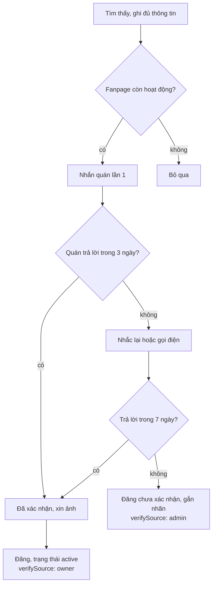

# Quy trình thu thập và xác nhận dữ liệu

6/10/2026 · @Manh Tri

## 1. Mục tiêu và nguyên tắc

Ra mắt lát 1 với 80–100 địa điểm chất lượng, do bạn tự thu thập thủ công từ Facebook rồi nhắn chủ quán xác nhận; mỗi lần liên hệ cũng là bước đầu xây quan hệ cho gói VIP sau này.

**Nguyên tắc:**

- **Thu thập thủ công**, không dùng công cụ scrape Facebook (vi phạm điều khoản của Meta, dễ bị khoá tài khoản).
- **Được ghi lại:** thông tin thực tế như tên, địa chỉ, giờ mở cửa, số điện thoại, link fanpage, mức giá.
- **Không được lấy khi chưa xin phép:** ảnh, bài viết, menu dạng ảnh, review của người khác. Viết mô tả và ghi chú bằng lời của bạn.
- **Mọi địa điểm có trạng thái xác nhận rõ ràng:** đã được quán xác nhận, hoặc chỉ dựa trên Facebook. Khách luôn thấy được sự khác biệt này.
- **Ưu tiên chất lượng hơn số lượng:** 80 điểm chính xác tốt hơn 150 điểm có nhiều quán đã đóng.

## 2. Chọn quán nào trước

Làm trước các điểm cần cho 5 lịch trình mẫu và điểm tham quan công cộng (không cần chủ quán xác nhận), sau đó mới mở rộng quán cà phê và ăn uống.

**Phân bổ mục tiêu khoảng 90 điểm:**

| Danh mục | Số điểm | Ghi chú |
| --- | --- | --- |
| Điểm tham quan | \~25 | Phần lớn là địa điểm công cộng, làm nhanh nhất |
| Cà phê | \~30 | Nhóm khách tìm nhiều nhất, cần xác nhận với quán |
| Ăn uống | \~25 | Đủ để chèn bữa trưa và tối ở cả 4 cụm |
| Hoạt động | \~10 | Canyoning, cắm trại, săn mây; có thể kèm link affiliate |

Theo cụm: Trung tâm khoảng 45%, Phía Nam 20%, Phía Đông 20%, Phía Bắc 15%. Mỗi cụm phải có đủ quán ăn để lịch trình chèn bữa mà không đi vòng.

**Hai đợt:**

1. **Đợt 1 (tuần 1–2), khoảng 40 điểm:** toàn bộ điểm dừng của 5 lịch trình mẫu, cộng các điểm tham quan công cộng chính.
2. **Đợt 2 (tuần 3–4), thêm 40–60 điểm:** quán cà phê và quán ăn được nhắc nhiều trong bài khảo sát group.

**Tiêu chí chọn quán:**

- Được nhắc nhiều trong group, TikTok hoặc bài khảo sát của bạn
- Fanpage còn hoạt động (mục 4)
- Mở cửa ít nhất 5 ngày mỗi tuần
- Nằm trong cụm đang thiếu điểm
- Đa dạng mức giá, không chỉ quán "sống ảo" đắt tiền
- Bỏ qua quán có bình luận gần đây nói đã đóng, đổi chủ hoặc chuyển địa điểm

## 3. Quy trình xác nhận

Mỗi quán đi qua tối đa hai lần liên hệ trong 7 ngày; sau đó luôn có kết quả rõ ràng để không tồn đọng.

*Quán được đăng sau tối đa hai lần liên hệ, kể cả khi không trả lời.*

Điểm tham quan công cộng (hồ, đồi, thác, khu du lịch không có fanpage) bỏ qua bước nhắn quán: xác minh qua nguồn chính thức hoặc OSM, dùng ảnh có giấy phép mở, đăng với `verifySource: admin`. Quán không có dấu hiệu hoạt động nhưng còn số điện thoại thì gọi một lần trước khi bỏ qua.

## 4. Thu thập từ Facebook

Mỗi quán ghi đủ các trường dưới đây trong khoảng 10 phút; trường nào Facebook không có thì để trống và hỏi khi nhắn quán.

| Trường | Tìm ở đâu trên fanpage | Ghi chú |
| --- | --- | --- |
| Tên quán | Tên trang, bài ghim | Ghi đúng cách quán tự gọi; tên khác (tiếng Anh, tên cũ) vào aliases |
| Địa chỉ | Mục Giới thiệu | Đối chiếu với bản đồ, ghim toạ độ bằng tay |
| Giờ mở cửa | Mục Giới thiệu, bài đăng gần nhất | Ghi theo từng ngày; nghi ngờ thì đánh dấu "cần hỏi" |
| Số điện thoại, Zalo | Mục Giới thiệu, nút Gọi | Chuẩn hoá về dạng +84 |
| Link fanpage, Instagram, TikTok |  | Dùng để chống trùng và liên hệ |
| Mức giá | Menu, bình luận | 1–4, dựa trên giá đồ uống hoặc món chính |
| Danh mục, tags | Ảnh và mô tả của quán | Ví dụ: chill, view đồi, sống ảo, gia đình |
| Trong nhà / ngoài trời | Ảnh không gian | Dùng cho phương án khi trời mưa |
| Ghi chú thực tế | Bình luận của khách | Viết bằng lời của bạn: đường dốc, chỗ đậu xe, giờ đông |
| Ngày bài đăng gần nhất | Dòng thời gian | Dùng để đánh giá fanpage còn hoạt động |

**Fanpage được coi là còn hoạt động khi** có ít nhất một trong các dấu hiệu: bài đăng trong 60 ngày gần nhất; trả lời bình luận hoặc tin nhắn gần đây; có review mới của khách trong 3 tháng. Không có dấu hiệu nào thì chưa đưa lên web, chờ xác nhận qua điện thoại.

**Dấu hiệu cần bỏ qua hoặc hỏi lại:** bài thông báo tạm nghỉ, sang nhượng, chuyển địa điểm; bình luận gần đây nói quán đã đóng; số điện thoại không liên lạc được.

**Không được lấy:** ảnh, bài viết, menu dạng ảnh, nội dung review. Có thể đọc để hiểu quán, nhưng mô tả trên web phải do bạn tự viết.

## 5. Bảng theo dõi

Tuần 1–2 dùng một Google Sheet; khi form nhập liệu trong admin xong (cuối tuần 2), nhập các dòng đã đủ thông tin vào admin và dùng admin làm nơi theo dõi chính.

**Tab "Địa điểm" (mỗi dòng một quán, tên cột khớp với trường của `Place` để script import đọc được):**

| Cột | Trường trên web | Định dạng, ví dụ |
| --- | --- | --- |
| id | (chỉ trong Sheet) | D001, D002… tăng dần, dùng làm tên thư mục Drive |
| name | name | Cà phê Mây |
| aliases | aliases | Phân cách bằng dấu ;, ví dụ May Coffee; Mây Café |
| category | category | Dropdown: attraction, cafe, food, activity |
| zone | zoneId | Dropdown: trung-tam, phia-nam, phia-bac, phia-dong |
| address | address | Địa chỉ đầy đủ |
| latlng | location | lat,lng lấy bằng cách ghim trên bản đồ, ví dụ 11.9404,108.4583 |
| hours | openingHours | Theo định dạng bên dưới |
| visit\_min | visitDurationMin | Số phút, ví dụ 60 |
| best\_time | bestTime | sunrise; morning; afternoon; sunset; evening |
| indoor | indoor | Dropdown: yes, no |
| price | priceLevel | Dropdown: 1, 2, 3, 4 |
| tags | tags | Chỉ dùng tags có trong tab "Tags", phân cách bằng ; |
| transport | transport | motorbike; car |
| notes | practicalNotes | Ghi chú thực tế, tự viết |
| phone | contact.phone | Dạng +84…, ví dụ +84912345678 |
| fanpage | contact.fanpage | Link đầy đủ |
| osm\_id | ids.osmId | Nếu dòng đến từ import OSM |

Các cột theo dõi (script bỏ qua): batch (1/2), last\_post\_date, status, channel (messenger, zalo, call), msg1\_date, remind\_date, result, photo\_status (none, owner, self, cc), drive\_folder, imported (yes/no).

**Định dạng giờ mở cửa:** các đoạn cách nhau bằng dấu ;, mỗi đoạn là `<ngày> <giờ mở>-<giờ đóng>`.

- Ngày: T2, T3, T4, T5, T6, T7, CN; khoảng `T2-T6`; danh sách `T2,T4`.
- Giờ dạng 24h `HH:mm`; nhiều ca trong ngày cách nhau bằng dấu phẩy: `T2-CN 06:30-11:00,14:00-22:00`.
- Qua nửa đêm được phép: `T6-T7 18:00-02:00`.
- Nghỉ: `T2 Đóng`. Cả ngày: `T2-CN 24h`.
- Ví dụ đầy đủ: `T2-T6 07:00-22:00; T7-CN 06:30-23:00`.

**Tab "Tags":** danh sách tags được phép dùng (ví dụ chill, view-doi, song-ao, gia-dinh, mao-hiem, an-sang, dac-san). Thêm tag mới thì thêm vào tab này trước.

**Google Drive:** một thư mục riêng tư cho dự án; mỗi quán một thư mục con đặt theo id và tên (ví dụ `D012-ca-phe-may`), chứa ảnh quán gửi và ảnh chụp màn hình tin nhắn đồng ý. Khi import, ảnh được upload lên R2; ảnh chụp tin nhắn giữ lại trên Drive làm bằng chứng.

**Chuyển vào admin (story S21 trong backlog):** export tab "Địa điểm" ra CSV, chạy script import: chỉ lấy các dòng có status là "Đã xác nhận", "Sẵn sàng đăng" hoặc "Đăng chưa xác nhận" và imported khác yes; validate bằng schema Zod; tạo `Place` dạng nháp với `verifySource` là owner (quán đã xác nhận) hoặc admin (còn lại); in báo cáo các dòng lỗi định dạng. Sau đó bạn vào admin upload ảnh, kích hoạt, rồi đánh dấu imported = yes trong Sheet.

**Bảo mật:** Sheet và thư mục Drive chứa số điện thoại và tin nhắn với chủ quán, nên luôn để riêng tư, không chia sẻ bằng link công khai.

**Trạng thái:**

| Trạng thái | Ý nghĩa | Bước tiếp theo |
| --- | --- | --- |
| Tìm thấy | Có tên và fanpage | Ghi đủ trường ở mục 4 |
| Đã ghi thông tin | Đủ trường, fanpage còn hoạt động | Nhắn quán |
| Đã nhắn | Gửi tin nhắn lần 1 | Chờ 3 ngày |
| Đã nhắc | Gửi tin nhắc hoặc gọi điện | Chờ 4 ngày |
| Đã xác nhận | Quán xác nhận thông tin | Xin ảnh nếu chưa có |
| Sẵn sàng đăng | Đã xác nhận và có ảnh hợp lệ | Kích hoạt trên admin |
| Đăng chưa xác nhận | Quán không trả lời sau 7 ngày, fanpage vẫn hoạt động | Đăng kèm nhãn, thử liên hệ lại sau 1 tháng |
| Bỏ qua | Đã đóng, sang nhượng, hoặc fanpage không hoạt động | Không đăng |

**Ánh xạ sang dữ liệu trên web:**

| Trường hợp | verifySource | Hiển thị trên web |
| --- | --- | --- |
| Quán đã xác nhận | owner | Bình thường, có ngày xác nhận |
| Chỉ dựa trên Facebook | admin | Nhãn "Thông tin chưa được quán xác nhận" |
| Điểm tham quan công cộng | admin | Bình thường |

## 6. Mẫu tin nhắn và lịch nhắc lại

Gửi qua Messenger của fanpage trước; sau 3 ngày chưa trả lời thì nhắn Zalo hoặc gọi; sau 7 ngày vẫn không có phản hồi thì xử lý theo mục 5. Thay phần trong ngoặc vuông trước khi gửi.

**Lần 1, khi web chưa ra mắt (tuần 1–4):**

> Chào anh/chị \[Tên quán\], em là Trí, đang làm một cẩm nang du lịch Đà Lạt trên web để giúp khách lên lịch trình. Em muốn giới thiệu quán mình miễn phí trong mục \[Cà phê view đồi / Quán ăn khu trung tâm\]. Anh/chị xác nhận giúp em thông tin này đã đúng chưa ạ: địa chỉ \[địa chỉ\], giờ mở cửa \[giờ\], số điện thoại \[số\]. Nếu được, anh/chị cho em xin 3–5 ảnh đẹp của quán để đăng kèm, em sẽ ghi nguồn là của quán. Em cảm ơn ạ!

**Lần 1, khi đã có trang của quán trên web:**

> Chào anh/chị \[Tên quán\], quán mình đã được giới thiệu trong mục \[tên mục\] trên \[tên web\], đây là trang của quán: \[link\]. Anh/chị xem giúp em thông tin đã đúng chưa, có ảnh đẹp hơn thì gửi em cập nhật miễn phí nhé. Em cảm ơn ạ!

**Nhắc lại sau 3 ngày (Zalo hoặc tin nhắn ngắn):**

> Dạ em nhắn lại để xác nhận thông tin quán \[Tên quán\] trên cẩm nang Đà Lạt ạ. Anh/chị chỉ cần trả lời "đúng" hoặc sửa giúp em giờ mở cửa là được. Em cảm ơn!

**Gọi điện (khi nhắn tin không được):** giới thiệu một câu, hỏi đúng 3 thông tin (địa chỉ, giờ mở cửa, còn hoạt động không), xin phép dùng ảnh và hỏi kênh để nhận ảnh. Ghi kết quả vào bảng ngay sau cuộc gọi.

**Sau khi quán xác nhận:**

> Em cảm ơn anh/chị nhiều ạ. Khi web ra mắt em sẽ gửi link trang của quán. Sau này anh/chị có thể tự cập nhật thông tin, menu và khuyến mãi miễn phí trên trang đó.

**Lưu ý:** không hứa lượng khách hay vị trí hiển thị; không nhắc đến gói trả phí trong giai đoạn này; mỗi ngày nhắn tối đa 20–30 quán để tài khoản Facebook không bị đánh dấu spam.

## 7. Ảnh và ghi nguồn

Mỗi ảnh trên web phải có nguồn rõ ràng; địa điểm chưa có ảnh hợp lệ vẫn đăng được, hiển thị "Ảnh đang cập nhật" kèm bản đồ.

| Nguồn ảnh | Dùng cho | Ghi nguồn trên web |
| --- | --- | --- |
| Quán gửi hoặc cho phép dùng (có tin nhắn đồng ý) | Quán cà phê, quán ăn, hoạt động | "Ảnh: \[Tên quán\]" |
| Wikimedia Commons (CC BY, CC BY-SA, CC0) | Điểm tham quan công cộng | Tên tác giả + giấy phép + link, đúng yêu cầu của giấy phép |
| Tự chụp (khi đi Đà Lạt sau này) | Mọi địa điểm | "Ảnh: \[tên web\]" |

**Quy tắc:**

- Lưu ảnh chụp màn hình tin nhắn quán đồng ý cho dùng ảnh, gắn với ID địa điểm trong bảng theo dõi.
- Không dùng ảnh từ Google Maps, Foody, blog, TikTok hay ảnh khách đăng trên fanpage, kể cả khi quán đã chia sẻ lại.
- Không dùng ảnh do AI tạo cho địa điểm có thật.
- Với Wikimedia Commons, kiểm tra giấy phép từng ảnh, không chỉ dựa vào trang tìm kiếm; tránh ảnh có giấy phép "NC" (không thương mại) vì web có affiliate.
- Khi upload, form admin bắt buộc chọn nguồn và nhập thông tin ghi nguồn (story S06).

## 8. Định mức theo tuần

Mỗi địa điểm mất khoảng 15 phút (10 phút ghi thông tin, 5 phút nhắn và theo dõi), tức khoảng 22 giờ cho 90 điểm, chia ra 5–6 giờ mỗi tuần cộng thêm vào thời gian code.

| Tuần | Thu thập | Liên hệ quán | Trên web (admin) |
| --- | --- | --- | --- |
| 1 (6–12/10) | Ghi đủ thông tin 40 điểm đợt 1 | Nhắn lần 1 các quán đợt 1 | Chưa có |
| 2 (13–19/10) | Ghi đủ thông tin 30 điểm đợt 2 | Nhắc lại đợt 1 | Nhập đợt 1 vào admin cuối tuần |
| 3 (20–26/10) | Ghi thêm 20 điểm đợt 2 | Nhắn lần 1 đợt 2 | 40 điểm active |
| 4 (27/10–2/11) | Bổ sung chỗ còn thiếu theo cụm | Nhắc lại đợt 2 | 80 điểm active |
| 5 (3–9/11) | Rà soát | Gửi link trang cho các quán đã xác nhận | 90 điểm active |

**Cách làm gọn thời gian:**

- Làm theo cụm: mỗi buổi chỉ làm một cụm để dễ ghim toạ độ và phát hiện chỗ thiếu.
- Làm theo lô: mỗi ngày một buổi khoảng 1 giờ (khoảng 4 điểm), không xen kẽ với code.
- Dùng import OSM (story S08) để có sẵn tên và toạ độ, chỉ bổ sung phần còn thiếu.
- Lưu các mẫu tin nhắn ở mục 6 thành phím tắt văn bản trên điện thoại hoặc máy tính.
- Gom mọi trường "cần hỏi" của một quán vào một tin nhắn duy nhất.
- Không theo đuổi quá 2 lần liên hệ; quán không trả lời thì xử lý theo trạng thái "Đăng chưa xác nhận" hoặc "Bỏ qua".
