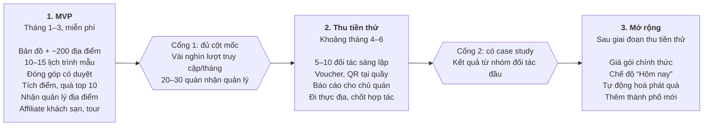

# Spec sản phẩm: Cẩm nang số Đà Lạt (MVP)

5/10/2026 · @Manh Tri

## 1. Tổng quan

Sản phẩm là một cẩm nang số cho Đà Lạt trên web (PWA): bản đồ địa điểm được curate, lịch trình tối ưu theo tuyến đường, cộng đồng đóng góp có tích điểm, và kênh để chủ quán tiếp cận khách. Mục tiêu MVP trong 3 tháng là chứng minh nền tảng mang khách thật đến quán, đo được bằng số liệu.

**Tên thương hiệu:** Rành Đường, tên miền `ranhduong.vn`.

**Vấn đề:** Khách lên kế hoạch đi Đà Lạt bằng TikTok, group Facebook hoặc ChatGPT. Thông tin rời rạc, nhiều quán đã đóng, lịch trình đi vòng và không tính đến thời tiết. Chủ quán trả tiền cho KOL nhưng không đo được hiệu quả.

**Khác biệt so với hiện trạng:**

| Đối thủ | Có gì | Thiếu gì |
| --- | --- | --- |
| Thổ Địa Phú Yên (mô hình tham chiếu) | Cộng đồng tích điểm, gói VIP cho quán, lịch trình mẫu | Chỉ một tỉnh, khó nhân rộng, lịch trình đơn giản |
| dalat.vn / DalatFlowerCity | Bản đồ, app, kênh của chính quyền | Thiếu cộng đồng, cập nhật chậm |
| Blog, OTA (iVIVU, Mytour…) | Nội dung SEO | Nội dung tĩnh, nhiều bài cũ, không tương tác |
| Group Facebook, TikToker | Cộng đồng mạnh | Không có sản phẩm, dữ liệu rải rác |

**Lợi thế cần giữ:** dữ liệu được xác minh (còn mở, đúng giờ), lịch trình hợp lý theo cụm khu vực và thời tiết, số liệu hiệu quả cho chủ quán, kiến trúc nhiều thành phố ngay từ đầu.

**Giao diện:** phong cách "Sổ tay của người địa phương" (bản đồ vẽ tay, ghi chú viết tay, giọng văn địa phương, đổi theo mùa và thời tiết, vé chia sẻ, sổ tem). Chi tiết: [Spec UI: Rành Đường](ui-spec.md).

## 2. Phạm vi MVP và lộ trình

Làm MVP trong 3 tháng, chỉ thu tiền quán khi đạt cột mốc ở mục 11, rồi mới mở rộng.

*MVP 3 tháng trước, chỉ thu tiền khi đủ cột mốc rồi mới mở rộng.*

MVP chạy không cần hợp tác với quán; voucher, QR tại quầy và gói trả phí chỉ bật từ giai đoạn 2.

**Ngoài phạm vi MVP:** AI chat, VR360, bản đồ 3D, app native, Zalo Mini App, cả nhóm cùng chỉnh lịch trình, OTP SMS và Zalo ZNS (cần pháp nhân).

**MVP ra mắt theo 4 lát, mỗi lát dùng được ngay:**

1. Lát 1: bản đồ, trang địa điểm, danh sách curate, 5 lịch trình mẫu tĩnh, SEO, công cụ nhập liệu, bản đồ phong cách sổ tay, giao diện theo mùa và thời tiết. Ra mắt trước 15/11/2026 để đón mùa dã quỳ và cao điểm cuối năm. Chi tiết: [Backlog lát 1: Cẩm nang số Đà Lạt](backlog.md).
2. Lát 2: tạo lịch trình theo yêu cầu, đổi điểm, chia sẻ, vé lịch trình dạng ảnh để gửi Zalo và đăng story.
3. Lát 3: đăng nhập cho khách, đóng góp, hàng chờ duyệt.
4. Lát 4: check-in, tích điểm, quà, sổ tem.

**Chỉ số chính:** lượt bấm chỉ đường mỗi tuần, theo dõi từ lát 1.

## 3. Người dùng và phân quyền

Khách xem mọi thứ không cần đăng nhập; chỉ yêu cầu đăng nhập khi họ muốn giữ điểm, đua top hoặc nhận quà.

| Vai trò | Ai | Quyền chính |
| --- | --- | --- |
| Khách ẩn danh | Mọi người truy cập | Xem bản đồ, địa điểm, lịch trình mẫu; tạo và chia sẻ lịch trình; tích điểm vào ID khách tạm |
| Thành viên | Khách đã đăng nhập Google hoặc Zalo | Giữ điểm, đua top, nhận voucher, đóng góp và đánh giá |
| Thành viên tin cậy | 10–20 đóng góp được duyệt, tỉ lệ bị từ chối thấp | Sửa nhỏ (giờ mở cửa, số điện thoại) hiển thị ngay, duyệt sau |
| Thổ địa / Local Guide | Cấp cao nhất do admin chỉ định | Duyệt đóng góp của người khác |
| Chủ quán | Đã nhận quản lý địa điểm | Sửa thông tin quán, phát voucher, xem báo cáo, xác nhận đề xuất sửa |
| Cộng tác viên | Người thu thập dữ liệu được thuê (giai đoạn sau, chưa dùng trong MVP) | Tạo và xác minh địa điểm theo checklist, trả tiền sau khi duyệt |
| Admin | Chủ dự án | Toàn quyền, duyệt, merge, chốt bảng xếp hạng |

**Đăng nhập trong MVP: Google và Zalo, không cần form đăng ký, không cần pháp nhân.**

| Cách | Nhận được | Ghi chú |
| --- | --- | --- |
| Google | Tên, ảnh, email đã xác minh | Miễn phí; gửi thông báo qua email được |
| Zalo (Social API cơ bản) | ID, tên, ảnh | Tạo app bằng tài khoản Zalo cá nhân, cần xác thực domain; thường không có số điện thoại |

Phiên đăng nhập giữ bằng cookie httpOnly.

**Để sang giai đoạn 2 (khi đã có hộ kinh doanh hoặc công ty):**

- OTP SMS qua Firebase: bắt buộc gói Blaze, tính phí theo từng SMS. Phải giới hạn chỉ gửi đến +84, giữ reCAPTCHA và rate limit để chống SMS pumping.
- Zalo OA và ZNS: cần OA đã xác thực doanh nghiệp, mẫu tin được duyệt, phí theo tin.
- Quyền lấy số điện thoại qua Zalo: cần hỏi lại Zalo for Developers.

**Thu thập thông tin theo từng bước (chỉ hỏi khi khách có lý do để cung cấp):**

1. Chưa đăng nhập: chỉ có ID khách tạm trên trình duyệt; điểm, check-in, đóng góp gắn vào ID này.
2. Muốn giữ điểm hoặc đua top: đăng nhập Google/Zalo, điểm từ ID tạm được gộp vào tài khoản.
3. Lọt top 50 hoặc nhận quà: nhập số điện thoại hoặc Zalo để liên hệ, kèm ô đồng ý.
4. Tuỳ chọn: sở thích lưu lại từ lúc tạo lịch trình; số Zalo nhận thông báo trong hồ sơ.
5. Dữ liệu hành vi (xem, lưu, check-in, đổi điểm trong lịch trình) tự ghi nhận; chủ quán chỉ thấy số liệu tổng hợp.

Điểm của ID khách tạm không được tính vào bảng xếp hạng. Không thu thập ngày sinh, địa chỉ, giới tính nếu không dùng đến.

## 4. Dữ liệu địa điểm

Lát 1 ra mắt với 80–100 địa điểm Đà Lạt được xác minh, mở rộng dần lên 150–250; dữ liệu tự curate là nguồn chính, Google chỉ dùng để lưu place\_id và mở chỉ đường.

**Số lượng mục tiêu:** điểm tham quan 50–70, quán cà phê 50–70, ăn uống 40–60, hoạt động 15–20. Lưu trú lấy qua affiliate, không tự thu thập.

**Cụm khu vực Đà Lạt (định nghĩa thủ công):** Trung tâm; Phía Nam (Tuyền Lâm, Datanla, Trúc Lâm); Phía Bắc (Langbiang); Phía Đông (Trại Mát, Cầu Đất).

**Trường dữ liệu mỗi địa điểm:**

| Trường | Ví dụ / ghi chú |
| --- | --- |
| name, aliases | Tên chính và tên khác (tiếng Anh, tên cũ) |
| category, tags | cafe; chill, sống ảo, gia đình, mạo hiểm |
| location, zone | Toạ độ GeoJSON; cụm khu vực |
| opening\_hours | Theo ngày trong tuần |
| visit\_duration\_min | Thời gian tham quan đề xuất |
| best\_time | Bình minh, buổi sáng, hoàng hôn, buổi tối |
| weather\_sensitivity | Ngoài trời / trong nhà |
| price\_level, transport | Mức giá; xe máy, ô tô |
| practical\_notes | Đường dốc, chỗ đậu xe, bàn view đẹp |
| phone, fanpage, google\_place\_id, osm\_id | Định danh để chống trùng và xác minh |
| photos | Ảnh tự chụp, quán cho phép, hoặc giấy phép mở; lưu nguồn từng ảnh |
| status, last\_verified\_at, verify\_source, confidence\_score | Trạng thái và độ tin cậy |
| source, owner\_id, vip\_tier | admin / ctv / user / owner; chủ quán; gói |

**Theo dõi trạng thái hoạt động (chỉ dùng dữ liệu tự thu thập):**

- Nguồn: tự thu thập từ fanpage và nhắn quán xác nhận, chủ quán đã nhận quản lý tự cập nhật, khách báo "quán đã đóng" hoặc "sai giờ", OpenStreetMap (giấy phép ODbL, ghi nguồn).
- Nhắc xác minh theo tầng: điểm hot mỗi tháng, còn lại mỗi quý, bạn nhắn tin hoặc gọi điện cho quán.
- Chấm điểm nghi ngờ: fanpage lâu không đăng bài, website chết, số điện thoại không liên lạc được, có báo cáo từ khách. Đủ ngưỡng thì đẩy vào hàng đợi kiểm tra thủ công.
- Khách báo "quán đã đóng": 2–3 báo cáo thì tạm ẩn, chờ xác minh.
- Lịch trình bỏ qua điểm đang bị nghi ngờ hoặc có `last_verified_at` quá hạn.
- Điểm lâu chưa xác minh hiển thị cảnh báo "nên gọi trước khi đến".

**Dùng Google ở mức nào (đúng điều khoản):** điều khoản cấm lưu hoặc cache nội dung Google, trừ `place_id` (lưu vô thời hạn) và toạ độ (cache tối đa 30 ngày). Gọi định kỳ rồi lưu lại vẫn là cache, dù tần suất thấp.

| Dữ liệu Google | Điều khoản | Cách dùng trong sản phẩm |
| --- | --- | --- |
| `place_id` | Lưu vô thời hạn | Liên kết địa điểm, mở chỉ đường bằng URL Google Maps |
| Toạ độ | Cache tối đa 30 ngày | Không dùng; toạ độ lấy từ OSM hoặc tự ghim trên bản đồ |
| Giờ mở cửa, rating, review, ảnh | Không được lưu | Không dùng; nếu cần thì chỉ hiển thị trực tiếp khi khách xem trang, kèm ghi nguồn, tính phí theo lượt xem |

Không dùng dữ liệu Google để tạo hoặc bổ sung dữ liệu riêng. Đọc lại [Service Specific Terms](https://cloud.google.com/maps-platform/terms/maps-service-terms) và Places API Policies trước khi ra mắt.

**Chi phí Places API:** chỉ một lần Text Search khoảng 200 lượt để lấy `place_id` (trong hạn mức miễn phí 5.000 lượt/tháng); làm mới `place_id` bằng Place Details Essentials (IDs Only) miễn phí không giới hạn ([bảng giá](https://developers.google.com/maps/billing-and-pricing/pricing)). Đặt quota cho từng API.

## 5. Đóng góp cộng đồng và kiểm duyệt

Mọi đóng góp đi qua hàng chờ duyệt và kiểm tra trùng; chỉ cộng điểm sau khi được duyệt.

**Loại đóng góp:** thêm địa điểm mới, đề xuất sửa thông tin, báo quán đóng cửa, đánh giá kèm ảnh (sau khi đã check-in).

**Luồng gửi đóng góp:**

1. Khách ghim vị trí trên bản đồ trước khi nhập tên.
2. Hệ thống hiện các địa điểm trong bán kính khoảng 100m: "Có phải địa điểm này không?".
3. Khách nhập tên và thông tin; hệ thống tính điểm trùng.
4. Đóng góp vào bảng `submissions` với trạng thái chờ duyệt.
5. Admin hoặc thành viên cấp cao duyệt; được duyệt thì cập nhật `places` và cộng điểm.
6. Địa điểm đã có chủ quán nhận quản lý: đề xuất sửa được gửi cho chủ quán xác nhận trước.

**Phát hiện trùng:**

- Chuẩn hoá tên: chữ thường, bỏ dấu, bỏ từ chung ("quán", "tiệm", "cafe", "cà phê", "coffee", "homestay"), "&" thành "và".
- Lấy ứng viên bằng `$geoNear` (index `2dsphere`) trong bán kính 150m.
- Điểm trùng = 0,5 × trùng định danh (số điện thoại, fanpage, place\_id, osm\_id) + 0,4 × độ giống tên (Jaro-Winkler) + 0,1 × độ gần.

| Điểm trùng | Hành động |
| --- | --- |
| ≥ 0,85 | Chặn, chuyển sang "đề xuất sửa" cho địa điểm đã có |
| 0,6 – 0,85 | Cảnh báo, cho khách xác nhận; gắn cờ để kiểm duyệt viên xem kỹ |
| < 0,6 | Cho gửi bình thường |

Trường hợp đặc biệt: chuỗi cùng tên cách nhau trên 300m được tạo mới và gợi ý hậu tố chi nhánh; nhiều cơ sở trong một toà nhà được tạo nếu tên khác. Trang quản trị có công cụ **merge**: giữ bản chính, chuyển ảnh, đánh giá, check-in sang, redirect URL cũ.

**Chống lạm dụng:**

- Giới hạn số đóng góp mỗi ngày cho tài khoản mới.
- Theo dõi nhiều đóng góp từ cùng thiết bị hoặc số điện thoại (chủ quán giả làm khách).
- Đánh giá tiêu cực cần ảnh hoặc check-in mới được tính.
- So GPS lúc gửi với toạ độ địa điểm để chấm độ tin cậy.
- Điều khoản: người gửi cam kết ảnh là của mình và cấp quyền sử dụng; có nút báo cáo vi phạm. Không đăng nhà riêng hoặc ảnh có mặt người rõ nét khi chưa được đồng ý.

Giai đoạn đầu admin tự duyệt toàn bộ; hệ thống uy tín theo cấp (mục 3) bật dần khi lượng đóng góp tăng.

## 6. Tích điểm, check-in và phần thưởng

Điểm thưởng cho hành động tạo giá trị thật; MVP chạy được mà không cần hợp tác với quán, quà do nền tảng tự tài trợ.

**Kiếm điểm (giá trị điểm cụ thể chốt khi build):**

| Hành động | Điều kiện cộng điểm |
| --- | --- |
| Thêm địa điểm mới | Sau khi được duyệt |
| Đề xuất sửa, báo quán đóng | Sau khi được xác nhận đúng |
| Check-in | GPS trong khoảng 100m, tối đa 1 lần/quán/ngày |
| Đánh giá kèm ảnh tự chụp | Đã check-in tại quán |
| Hoàn thành lịch trình | Check-in đủ số điểm tối thiểu trong lịch trình |
| Giới thiệu bạn bè | Người được giới thiệu có hoạt động thật |

Không thưởng điểm cho đăng nhập hằng ngày hay bấm like. Tháng đầu có thể nhân đôi điểm cho đóng góp địa điểm.

**Check-in:** xác nhận khách thật sự có mặt tại địa điểm, để cộng điểm, cho phép đánh giá và làm số liệu cho chủ quán. Mức kiểm tra càng chặt khi phần thưởng càng giá trị.

| Giai đoạn | Cách check-in | Chống gian lận |
| --- | --- | --- |
| MVP (chưa có quán hợp tác) | GPS + ảnh chụp tại chỗ | Bán kính theo địa điểm, từ chối khi sai số GPS trên 200m, 1 lần/quán/ngày |
| Có quán hợp tác | QR tĩnh dán tại quầy + GPS | GPS chặn người quét ảnh QR từ xa; phát hiện check-in dồn dập từ tài khoản mới |
| Tuỳ chọn sau này | QR động trên thiết bị của quán, đổi mỗi 30–60 giây | Ảnh chụp QR hết hạn gần như ngay |
| Dùng voucher | Nhân viên quét hoặc nhập mã dùng một lần | Có người thật xác nhận |

Cách làm trên web:

- Geolocation API của trình duyệt (`navigator.geolocation`, bắt buộc HTTPS, khách phải cho phép quyền vị trí) trả về toạ độ và sai số; backend so khoảng cách bằng `$near` với `checkin_radius` của địa điểm.
- `checkin_radius`: quán nhỏ khoảng 100m; khu du lịch rộng (Langbiang, Tuyền Lâm) 500m–1km.
- Ảnh dùng `<input type="file" accept="image/*" capture="environment">` để mở camera sau; chỉ là lớp kiểm tra phụ vì một số trình duyệt vẫn cho chọn ảnh từ thư viện.
- GPS có thể bị làm giả trên Android, nên điểm từ check-in giữ ở mức nhỏ và top 10 luôn được duyệt thủ công.

**Dùng điểm:** đổi quà do nền tảng tài trợ, đổi voucher của quán đối tác (khi có), danh hiệu và cấp độ; mỗi lần check-in còn đóng một con tem minh hoạ vào sổ tem. Điểm không quy đổi ra tiền mặt và có thời hạn sử dụng.

**Thưởng theo hai nhóm người dùng.** Khách du lịch chỉ dùng web vài ngày rồi không quay lại, nên không thể chờ quà cuối tháng.

| Nhóm | Cách thưởng | Liên hệ để trao quà |
| --- | --- | --- |
| Khách du lịch | Thưởng ngay theo cột mốc trong chuyến đi: check-in đủ 3 điểm, hoàn thành lịch trình 1 ngày, đánh giá kèm ảnh | Không cần; quà hiện ngay trong Ví voucher, dùng trong chuyến đi |
| Người đóng góp (dân Đà Lạt, cộng tác viên, người đóng góp nhiều) | Bảng xếp hạng hằng tháng, quà top 10 | Bắt buộc có số Zalo hoặc email mới được tính vào bảng xếp hạng; nhắc khi lần đầu lọt top 50 |

**Quà theo cột mốc:** giới hạn số suất mỗi tháng; hết suất hiển thị "Quà tháng này đã hết". MVP chỉ thưởng huy hiệu; khi có quán tài trợ thì dùng voucher của quán.

**Quà top 10 hằng tháng:**

1. Cuối tháng, cron job lưu snapshot top 10.
2. Admin kiểm tra gian lận thủ công: đóng góp rác, nhiều tài khoản từ cùng thiết bị.
3. Mua e-voucher (Got It, UrBox) hoặc dùng quà quán tài trợ, gán cho từng người trong trang quản trị.
4. Liên hệ bằng số Zalo/điện thoại khách đã nhập (nhắn tay trong MVP), email với người dùng Google, Web Push với người đã cài PWA.
5. Người thắng bấm "Nhận quà" trong Ví voucher để hiện mã; hạn nhận 7–14 ngày, quá hạn chuyển cho hạng tiếp theo.
6. Công bố top 10 trên web và fanpage (che bớt tên hoặc hỏi ý người thắng).

**Ngân sách quà (trần cố định, không tăng theo số người dùng):**

| Thời điểm | Chi (VNĐ) | Nội dung |
| --- | --- | --- |
| Tháng 1 | 0 | Huy hiệu, danh hiệu, nêu tên trên fanpage |
| Tháng 2–3 | 300–500 nghìn/tháng | Top 3 khoảng 50 nghìn/người, hạng 4–10 khoảng 30 nghìn/người; bắt đầu xin 2–3 quán tài trợ |
| Khi có quán tài trợ đều | Chỉ giữ phần top 10 | Quà cho khách du lịch chuyển sang voucher của quán |

Tổng quà cho 3 tháng MVP khoảng 1 triệu đồng. Quán tài trợ quà (5–10 ly/tháng) để đổi lấy danh hiệu "Quán tài trợ quà tháng này" là bước đầu xây quan hệ với chủ quán. Giá e-voucher là ước tính; kiểm tra mức mua tối thiểu và phí của Got It/UrBox.

**Sổ cái điểm:** `point_transactions` dạng append-only (cộng/trừ, lý do, tham chiếu). Số dư tính từ sổ cái hoặc cache nhưng luôn đối chiếu được.

## 7. Chủ quán, voucher và gói VIP

Chủ quán nhận quản lý miễn phí trang đã có sẵn; voucher và QR tại quầy chỉ bật khi đã có hợp tác.

**Nhận quản lý địa điểm:**

1. Mỗi trang có nút "Bạn là chủ quán? Nhận quản lý địa điểm này".
2. Xác minh qua số điện thoại của quán hoặc Zalo; admin duyệt.
3. Chủ quán cập nhật ảnh, menu, giá, khuyến mãi; xác nhận đề xuất sửa từ khách.

**Báo cáo hiệu quả cho chủ quán:** lượt xem trang, lượt bấm chỉ đường, lượt gọi, lượt check-in, số lần xuất hiện trong lịch trình, voucher đã nhận và đã dùng.

**Voucher do quán phát hành:**

- Loại: giảm %, giảm số tiền cố định, tặng món.
- Điều kiện: giá trị đơn tối thiểu, khung giờ áp dụng (ưu tiên giờ vắng, ví dụ 14h–16h), tổng số lượng, giới hạn mỗi người, hạn dùng.
- Chỉ tài khoản đã đăng nhập mới nhận được; mỗi tài khoản một lượt mỗi voucher.

**Luồng dùng voucher:**

1. Khách nhận voucher; hệ thống tạo mã dùng một lần gắn với tài khoản, lưu trong Ví voucher.
2. Tại quán, khách mở mã (QR hoặc mã có hiệu lực khoảng 5 phút để tránh chụp màn hình chia sẻ).
3. Nhân viên nhập hoặc quét mã trên trang quản lý của quán, đánh dấu đã dùng.
4. Khách chưa có voucher có thể quét QR ở quầy, đăng nhập Google/Zalo, nhận và dùng ngay.

**Gói dịch vụ:**

| Gói | Quyền lợi |
| --- | --- |
| Miễn phí | Nhận quản lý, cập nhật thông tin, số liệu cơ bản |
| Starter | Ưu tiên trong danh mục, phát voucher, báo cáo chi tiết |
| VIP | Lên đầu danh sách và bản đồ, ưu tiên trong lịch trình (có nhãn "Đối tác"), xuất hiện trong nội dung fanpage/TikTok, số lượt voucher được đẩy |

Giá chốt sau khi hỏi chủ quán đang trả bao nhiêu cho KOL và quảng cáo; gói phải rẻ hơn rõ rệt nhưng đo được hiệu quả.

## 8. Lên lịch trình

Lịch trình mẫu do người curate là nền; lịch trình cá nhân được tạo bằng cách tuỳ chỉnh từ mẫu gần nhất. Thuật toán lo tuyến đường, LLM chỉ viết mô tả.

**Lịch trình mẫu (MVP: 13 mẫu, tối đa 4N3Đ):** 4 cụm khu vực đủ phủ trong 4 ngày; từ ngày thứ 5 lịch trình bắt đầu lặp điểm. Mỗi lịch trình mẫu là một trang SEO riêng.

| Thời lượng | Số mẫu | Phong cách |
| --- | --- | --- |
| 1 ngày | 3 | Trung tâm, săn mây + đồi chè, cà phê chill |
| 2N1Đ | 4 | Cặp đôi, nhóm bạn, gia đình, sống ảo |
| 3N2Đ | 4 | Cặp đôi, nhóm bạn, gia đình, khám phá |
| 4N3Đ | 2 | Trọn vẹn 4 cụm, thong thả |

**Tạo theo yêu cầu: tối đa 5 ngày.** Ngày thứ 5 đặt nhịp thong thả (cà phê, chợ, mua đặc sản). Trên 5 ngày, gợi ý ghép lịch trình 4N3Đ với một ngày tự do kèm danh sách quán cà phê và điểm ít người biết để khách tự chọn.

**Đầu vào (nút bấm, không gõ):** số ngày, ngày đi, phương tiện, đi cùng ai, gu, nhịp độ (thong thả / dày), nơi lưu trú làm điểm xuất phát.

**Thuật toán:**

1. Lọc ứng viên theo tag, gu, giờ mở cửa và trạng thái hoạt động.
2. Gán 1–2 cụm khu vực gần nhau cho mỗi ngày; không ghép Langbiang với Cầu Đất.
3. Sắp thứ tự trong ngày bằng nearest neighbor + 2-opt (TypeScript), xuất phát và kết thúc ở nơi lưu trú.
4. Ràng buộc giờ: săn mây lúc 4–6h là điểm đầu, chợ đêm là điểm cuối, tôn trọng giờ mở cửa.
5. Chèn bữa ăn 11h30–13h và 18h–19h30, chọn quán gần điểm trước và điểm sau.
6. Gợi ý điểm tiện đường khi detour = d(A,X) + d(X,B) − d(A,B) dưới 10 phút.
7. Ngày đi rơi vào mùa mưa (khoảng tháng 5–11): ưu tiên điểm trong nhà buổi chiều.
8. LLM model rẻ viết lời mô tả từ kết quả đã sắp xếp.

Khi cần ràng buộc khung giờ chặt hơn (VRPTW), chuyển sang Google OR-Tools chạy qua microservice Python.

**Chỉnh sửa:** kéo thả đổi thứ tự (tính lại thời gian di chuyển), "Đổi điểm khác tương tự" (cùng loại, cùng cụm, đang mở), khoá điểm rồi "Tối ưu lại".

**Địa điểm VIP trong lịch trình:** chỉ chèn khi đã khớp tiêu chí của khách, luôn có nhãn "Đối tác", tối đa 1–2 điểm mỗi ngày. Gắn voucher vào từng điểm khi quán có voucher.

**Chia sẻ:** link công khai, nút chia sẻ qua Zalo và Messenger; vé lịch trình dạng ảnh dọc kiểu vé tàu, đồng thời là ảnh xem trước khi dán link (lát 2).

**Vòng phản hồi:** ghi lại điểm bị đổi, bỏ qua, giữ lại; điểm hay bị đổi giảm thứ hạng. Hỏi nhanh sau chuyến đi.

**Giai đoạn sau:** chế độ "Hôm nay" (điểm tiếp theo, mở chỉ đường Google Maps, phương án khi mưa, thay quán đóng cửa), cả nhóm cùng chỉnh lịch trình.

## 9. Kiến trúc kỹ thuật và data model

Monorepo Turborepo gồm web Nuxt 4 (Vue 3, TypeScript, tổ chức theo FSD) và một API NestJS dùng chung; mọi dữ liệu gắn `cityId` để mở thành phố mới chỉ bằng dữ liệu. Sơ đồ triển khai, phân lớp NestJS, luồng chính, cache và kế hoạch mở rộng: [Kiến trúc hệ thống: Rành Đường](architecture.md). Chi tiết data model và API: [Thiết kế kỹ thuật: Cẩm nang số Đà Lạt (MVP)](technical-design.md).

**Quyết định kỹ thuật:**

- Ma trận khoảng cách tính sẵn bằng OSRM với dữ liệu OSM Việt Nam, lưu vào `distance_matrix`; MVP có thể dùng khoảng cách chim bay × 1,4.
- Lịch trình cache theo hash bộ tham số đầu vào.
- Rate limit theo IP và tài khoản cho tạo lịch trình, gửi đóng góp, nhận voucher.
- Phiên đăng nhập bằng cookie httpOnly; field mask khi gọi Places API.

**Collections MongoDB:**

| Collection | Nội dung chính |
| --- | --- |
| cities, zones | Thành phố; cụm khu vực (polygon) |
| places | Các trường ở mục 4, `location` index 2dsphere, lịch sử chỉnh sửa |
| submissions | type (new, edit, report), status, submitted\_by, evidence, duplicate\_score |
| users | phone, provider (otp, google, zalo), role, trust\_level, guest\_id đã gộp |
| place\_claims | Yêu cầu nhận quản lý, cách xác minh, trạng thái |
| point\_transactions | Sổ cái append-only: user\_id hoặc guest\_id, delta, reason, ref |
| checkins | user, place, toạ độ lúc check-in, phương thức (gps, qr), thời gian |
| vouchers | place, loại, điều kiện, khung giờ, số lượng, hạn |
| voucher\_claims | code, status (claimed, used, expired), expires\_at, used\_at |
| leaderboard\_snapshots, rewards | Top 10 mỗi tháng; quà, mã e-voucher, hạn nhận |
| itineraries | template hoặc của người dùng, tham số đầu vào, ngày → các điểm, link chia sẻ |
| itinerary\_events | Điểm bị đổi, bỏ qua, giữ lại; phản hồi sau chuyến đi |
| distance\_matrix | Cặp điểm, thời gian và quãng đường theo phương tiện |
| place\_metrics | Lượt xem, bấm chỉ đường, gọi, xuất hiện trong lịch trình theo ngày |

## 10. Vận hành dữ liệu và go-to-market

Bạn tự thu thập dữ liệu từ Facebook rồi nhắn chủ quán xác nhận; chưa dùng cộng tác viên trong MVP. Mỗi lần liên hệ cũng là bước đầu xây quan hệ với quán. Quy trình chi tiết: [Quy trình thu thập và xác nhận dữ liệu](data-collection.md).

1. **Khảo sát cộng đồng (tuần 1):** đăng bài hỏi trong các group Đà Lạt (không link) để biết quán nào được nhắc nhiều.
2. **Thu thập thủ công từ fanpage:** tên, địa chỉ, giờ mở cửa, số điện thoại, mức giá, ghi chú thực tế viết bằng lời của bạn. Không dùng công cụ scrape, không lấy ảnh hay bài viết khi chưa xin phép.
3. **Nhắn quán xác nhận:** tối đa hai lần liên hệ trong 7 ngày. Quán xác nhận thì đăng với `verifySource: owner`; không trả lời nhưng fanpage còn hoạt động thì đăng kèm nhãn "Thông tin chưa được quán xác nhận".
4. **Mục tiêu ra mắt lát 1:** 80–100 điểm chất lượng, ưu tiên điểm dừng của lịch trình mẫu và điểm tham quan công cộng; mở rộng dần lên 150–250 sau ra mắt.
5. **Sau khi có web:** gửi link trang của quán, mời nhận quản lý miễn phí.
6. **Đi thực địa (sau MVP):** khi đã có số liệu và vài quán quan tâm, đi một chuyến để gặp trực tiếp, chụp ảnh và chốt hợp tác.

**Nguồn ảnh hợp lệ:** ảnh quán gửi hoặc cho phép (lưu lại tin nhắn đồng ý), Wikimedia Commons cho điểm công cộng (không dùng giấy phép NC), ảnh tự chụp. Chưa có ảnh hợp lệ thì hiển thị "Ảnh đang cập nhật".

**Đối tác địa phương:** vẫn nên tìm một group Facebook hoặc TikToker review Đà Lạt có sẵn cộng đồng; cộng tác viên chỉ cân nhắc khi mở rộng sang nhiều điểm hoặc thành phố mới.

## 11. Kiếm tiền, chi phí và KPI

MVP 3 tháng tốn khoảng 10–15 triệu đồng nếu làm tiết kiệm, 30–40 triệu nếu đẩy marketing; thu tiền gói VIP khi đạt cột mốc, không theo thời gian. Các con số là ước tính.

**Chi phí MVP:**

| Hạng mục | Chi phí (VNĐ) | Ghi chú |
| --- | --- | --- |
| VPS backend | 150–250 nghìn/tháng | 1–2 vCPU |
| MongoDB Atlas M0, Cloudflare (CDN, Tunnel, Pages cho admin), R2 | 0 | Gói miễn phí |
| Google Places API | 0 | Trong hạn mức miễn phí với \~200 POI |
| LLM viết mô tả lịch trình | 50–250 nghìn/tháng | Model rẻ, có cache |
| OTP SMS/ZNS | Vài trăm đồng/tin | Giai đoạn 2, sau khi có pháp nhân |
| Domain | \~300 nghìn/năm |  |
| Cộng tác viên | 0 trong MVP | Tự thu thập; cân nhắc thuê khi mở rộng |
| Quà top 10 | 0 tháng đầu, sau đó 300–500 nghìn/tháng | E-voucher |
| Quảng cáo, KOL | 2–5 triệu/tháng | Chỉ khi nội dung tự nhiên đã chạy tốt |

OSRM chạy local một lần để tính ma trận khoảng cách, không cần server thường trực. Đặt quota API và cảnh báo ngân sách cho Google Cloud và LLM ngay từ đầu.

**Nguồn thu:**

- **Affiliate khách sạn, tour** (Agoda, Booking, Klook): gắn ngay từ MVP.
- **Gói Starter/VIP cho quán:** thu thử khoảng tháng 4–6 với 5–10 "đối tác sáng lập", giá ưu đãi cố định 6 tháng.
- **Gói nội dung:** video review trên kênh TikTok khi kênh có lượng xem ổn định.

**Cột mốc bắt đầu thu tiền:**

- [ ] Vài nghìn lượt truy cập/tháng, tăng đều
- [ ] Quán nổi bật có số liệu lượt xem, bấm chỉ đường, check-in
- [ ] 20–30 quán đã nhận quản lý và chủ động cập nhật
- [ ] Có quán tự hỏi cách hiển thị nổi bật hơn
- [ ] Đã có hộ kinh doanh hoặc công ty để xuất hoá đơn

**KPI theo dõi:** lượt truy cập/tháng, số lịch trình được tạo và chia sẻ, số đóng góp được duyệt, số tài khoản đã xác minh, số quán nhận quản lý, lượt bấm chỉ đường mỗi quán, tỉ lệ voucher được dùng, số quán trả tiền.

## 12. Rủi ro, pháp lý và câu hỏi mở

Rủi ro lớn nhất không nằm ở kỹ thuật mà ở việc thiếu người tại chỗ và chủ quán không chịu trả tiền.

| Rủi ro | Cách giảm |
| --- | --- |
| Không có lý do để khách chọn thay vì TikTok/ChatGPT | Dữ liệu xác minh, lịch trình hợp lý theo cụm và thời tiết; thể hiện khác biệt ngay lần dùng đầu |
| Thiếu người tại Đà Lạt | Tự thu thập từ xa qua Facebook và tin nhắn; tìm đối tác địa phương khi mở rộng |
| Chủ quán không trả tiền | Bán thử "đối tác sáng lập" sớm; báo cáo hiệu quả bằng số liệu |
| Dữ liệu cũ nhanh (quán mở/đóng liên tục) | Refresh theo tầng, báo cáo từ người dùng, chủ quán tự cập nhật |
| Vi phạm điều khoản Google | Chỉ lưu `place_id`; dữ liệu tự curate là nguồn chính |
| Khiếu nại bản quyền ảnh | Chỉ ảnh tự chụp hoặc được cho phép; nút báo cáo, gỡ nhanh |
| Gian lận điểm, voucher | Xác minh số điện thoại, giới hạn số lần, GPS, mã dùng một lần, duyệt top 10 thủ công |
| VIP làm mất niềm tin | Gắn nhãn, tối đa 1–2 điểm/ngày, chỉ khi phù hợp |
| Chi phí API tăng đột biến | Cache, rate limit, quota, cảnh báo ngân sách |
| Quá tải thời gian cá nhân | Chọn một dự án trọng tâm trong vài tháng đầu |

**Pháp lý:**

- Khuyến mại tuân theo quy định hiện hành (Nghị định 81/2018). Hình thức may rủi (quay số, "lắc trúng quà") có thể phải đăng ký; tích điểm đổi quà đơn giản hơn. Hỏi người có chuyên môn trước khi chạy quà giá trị lớn.
- Cần hộ kinh doanh hoặc công ty để xuất hoá đơn trước khi thu tiền quán; hỏi kế toán để chọn hình thức.
- Điều khoản sử dụng: quyền dùng ảnh người dùng gửi, quy tắc cộng đồng, chính sách quyền riêng tư cho số điện thoại.
- Dữ liệu cá nhân (Nghị định 13/2023 và Luật Bảo vệ dữ liệu cá nhân có hiệu lực từ 2026): chính sách quyền riêng tư nêu rõ thu thập gì và để làm gì; xin đồng ý rõ ràng khi lấy số liên hệ và vị trí GPS; không thu thập dư; cho phép xoá tài khoản và dữ liệu. Nhờ người có chuyên môn pháp lý xem lại trước khi ra mắt.

**Câu hỏi mở:**

- [x] Tên sản phẩm và domain: đã chốt Rành Đường, ranhduong.vn
- [ ] Giá trị điểm cho từng hành động
- [ ] Giá gói Starter/VIP sau khi phỏng vấn chủ quán
- [ ] Quyền lấy số điện thoại qua Zalo OAuth cho web
- [ ] Có làm Zalo Mini App ở giai đoạn sau không
- [ ] Đối tác địa phương ở Đà Lạt là ai
- [ ] Số suất quà theo cột mốc mỗi tháng và quán nào tài trợ quà đầu tiên
