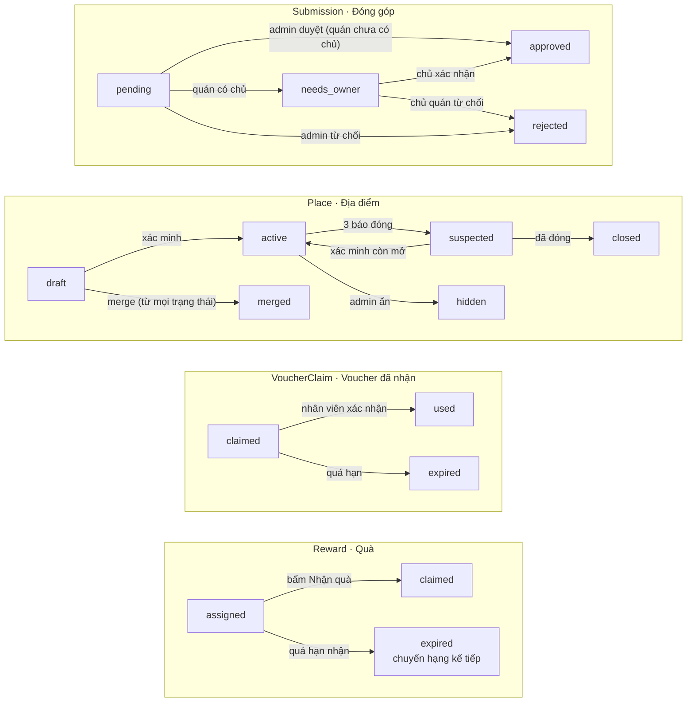

# Thiết kế kỹ thuật: Cẩm nang số Đà Lạt (MVP)

6/10/2026 · @Manh Tri

## 1. Tổng quan

Tài liệu này chuyển [Spec sản phẩm: Cẩm nang số Đà Lạt (MVP)](product-spec.md) thành thiết kế đủ để code MVP: một monorepo, một API NestJS dùng chung, MongoDB Atlas, một web SSR cho khách và hai SPA cho chủ quán và admin.

Sơ đồ triển khai, đường đi của request, phân lớp NestJS, giao tiếp giữa module, bản đồ cache, yêu cầu phi chức năng và kế hoạch mở rộng nằm ở [Kiến trúc hệ thống: Rành Đường](architecture.md); tài liệu này giữ phần chi tiết (data model, API, thuật toán, jobs, SEO, tracking).

| Lớp | Lựa chọn | Ghi chú |
| --- | --- | --- |
| Web cho khách | Nuxt 4 (Vue 3, TypeScript), SSR, PWA | Cần SSR cho SEO trang địa điểm và lịch trình |
| Trang chủ quán, trang quản trị | Vue 3 + Vite SPA | Không cần SEO; deploy tĩnh trên Cloudflare Pages |
| Bản đồ | MapLibre GL JS + tile của OpenFreeMap (bản public: miễn phí, không giới hạn, không API key) | URL style để trong cấu hình để có thể chuyển sang tự host PMTiles Việt Nam trên R2; khoá maxBounds và minZoom quanh thành phố; ghi nguồn OSM; không dùng Google Maps JS |
| Backend | NestJS + Mongoose | Một API, chia module theo nghiệp vụ |
| Database | MongoDB Atlas M0, lên Flex khi cần | Index 2dsphere, Atlas Search cho tìm không dấu |
| Hàng đợi, cache | BullMQ + Redis chạy trên VPS | Job nền, rate limit, cache lịch trình |
| Lưu ảnh | Cloudflare R2 | Upload qua presigned URL |
| Đăng nhập | Google OAuth, Zalo Social API | OTP SMS để giai đoạn 2 |
| Khoảng cách | OSRM chạy local một lần | Kết quả lưu vào `distance_matrix` |
| LLM | Một model giá rẻ qua API | Chỉ viết mô tả lịch trình |
| Hosting | Một VPS chạy Docker Compose (Nuxt, API, worker, Redis), Cloudflare làm CDN |  |
| Thời tiết | API thời tiết gọi phía server (Open-Meteo nếu điều khoản cho phép dùng thương mại) | Cache Redis 15 phút; quy tắc trong Spec UI mục 7 |
| Ảnh vé chia sẻ, ảnh OG | Satori (HTML sang SVG) + resvg (SVG sang PNG) trong worker | Nhúng font có tiếng Việt; ảnh lưu R2; lát 2 |
| UI | Token và component trong packages/ui theo Spec UI | Màu nhấn đổi theo thành phố và mùa qua CSS variable |

**Nguyên tắc thiết kế:**

- Dữ liệu tự curate là nguồn sự thật; Google chỉ cung cấp `place_id` và link chỉ đường.
- Mọi document nghiệp vụ có `cityId` để mở thành phố mới bằng dữ liệu.
- API không giữ trạng thái; việc nặng hoặc định kỳ đi qua hàng đợi.
- Điểm và voucher ghi sổ cái append-only, cập nhật bằng thao tác nguyên tử.
- Giữ đơn giản: một API, không microservice; OR-Tools chỉ thêm khi 2-opt không đủ.

## 2. Cấu trúc monorepo

Một repo Turborepo với 4 app và các package dùng chung; kiểu dữ liệu và schema validate nằm ở `packages/contracts` để frontend và backend dùng cùng một định nghĩa.

```text
apps/
  web/        Nuxt 3 SSR cho khách (FSD)
  owner/      Vue 3 SPA cho chủ quán (FSD)
  admin/      Vue 3 SPA quản trị (FSD)
  api/        NestJS: HTTP API + worker BullMQ (2 entrypoint)
packages/
  contracts/  DTO, enum, schema Zod dùng chung FE/BE
  ui/         Component Vue dùng chung, design token
  geo/        Haversine, chuẩn hoá tên, Jaro-Winkler, 2-opt
  config/     ESLint, tsconfig, Prettier
tools/
  osrm/       Script build ma trận khoảng cách từ OSM Việt Nam
  seed/       Import OSM, seed cities, zones, places
```

**Module NestJS (`apps/api`):**

| Module | Trách nhiệm |
| --- | --- |
| auth | OAuth Google/Zalo, phiên, gộp ID khách tạm |
| users | Hồ sơ, vai trò, cấp uy tín, thông tin liên hệ |
| cities | Thành phố, cụm khu vực |
| places | CRUD địa điểm, tìm kiếm, gần đây, trạng thái |
| submissions | Đóng góp, chống trùng, hàng chờ duyệt, merge |
| claims | Nhận quản lý địa điểm |
| itineraries | Lịch trình mẫu, tạo theo yêu cầu, chia sẻ, phản hồi |
| points | Sổ cái điểm, check-in, bảng xếp hạng |
| rewards | Quà cột mốc, quà top 10, ví voucher |
| vouchers | Voucher của quán, nhận, dùng |
| media | Presigned URL R2, kiểm tra ảnh |
| metrics | Ghi sự kiện, tổng hợp `place_metrics` |
| jobs | Định nghĩa queue và processor (chạy ở entrypoint worker) |

**FSD phía Vue:** `app` → `pages` → `widgets` → `features` → `entities` → `shared`. Entity chính: `place`, `itinerary`, `user`, `voucher`. Feature ví dụ: `checkin`, `submit-place`, `claim-voucher`, `swap-stop`. Gọi API qua client sinh từ `packages/contracts`.

## 3. Data model

Mọi collection có `_id` (ObjectId), `createdAt`, `updatedAt`; collection nghiệp vụ có `cityId`. Điểm và voucher không lưu số dư làm nguồn sự thật mà suy ra từ sổ cái.

**Địa điểm và khu vực:**

```ts
type GeoPoint = { type: 'Point'; coordinates: [lng: number, lat: number] };

interface City { slug: string; name: string; center: GeoPoint; timezone: 'Asia/Ho_Chi_Minh'; active: boolean; accent: string; mapBounds: [number, number, number, number];
  seasons: { key: string; from: string; to: string; accent: string; title: string; sub: string; illustration: string; featuredItineraryId?: ObjectId }[] }   // from/to dạng 'MM-DD'
interface Zone { cityId; slug: string; name: string; area: GeoJSON.Polygon }

type PlaceCategory = 'attraction' | 'cafe' | 'food' | 'activity' | 'stay' | 'shop';
type PlaceStatus = 'draft' | 'active' | 'suspected' | 'hidden' | 'closed' | 'merged';

interface Place {
  cityId; zoneId; slug: string; slugHistory: string[];   // slug duy nhất trong city
  name: string; aliases: string[]; nameNorm: string;   // nameNorm cho chống trùng
  category: PlaceCategory; alsoCategories: PlaceCategory[]; tags: string[];   // danh mục phụ, tối đa 2, khác category (S27)
  location: GeoPoint; address: string; checkinRadiusM: number;  // mặc định 100
  openingHours: { day: 0 | 1 | 2 | 3 | 4 | 5 | 6; open: string; close: string }[]; // '07:00'
  visitDurationMin: number;
  bestTime: ('sunrise' | 'morning' | 'afternoon' | 'sunset' | 'evening')[];
  cover?: 'full' | 'partial' | 'none'; priceLevel: 1 | 2 | 3 | 4; transport: ('motorbike' | 'car')[];
  practicalNotes?: string;
  contact: { phone?: string; fanpage?: string; website?: string };
  ids: { googlePlaceId?: string; osmId?: string };
  photos: { key: string; source: 'self' | 'owner' | 'ctv' | 'user' | 'cc'; credit?: string; license?: string }[];
  status: PlaceStatus; mergedInto?: ObjectId;
  lastVerifiedAt?: Date; verifySource?: 'ctv' | 'owner' | 'admin' | 'user'; suspicionScore: number;
  source: 'admin' | 'ctv' | 'user' | 'owner'; ownerId?: ObjectId; vipTier: 'free' | 'starter' | 'vip';
  stampKey?: string; ratingAvg?: number; ratingCount: number;  // chỉ từ đánh giá trên nền tảng
}
```

**Người dùng, đóng góp, nhận quản lý:**

```ts
type Role = 'member' | 'trusted' | 'guide' | 'owner' | 'ctv' | 'admin';
interface User {
  providers: { kind: 'google' | 'zalo'; subject: string; email?: string }[];
  displayName: string; avatarUrl?: string; roles: Role[];
  contact?: { phone?: string; zalo?: string; consentAt: Date };
  mergedGuestIds: string[]; preferences?: { travelWith?: string; tags?: string[] };
  approvedCount: number; rejectedCount: number; deletedAt?: Date;
}

type SubmissionType = 'new' | 'edit' | 'report_closed' | 'report_wrong';
interface Submission {
  cityId; type: SubmissionType; placeId?: ObjectId; payload: Partial<Place>;
  submittedBy: { userId?: ObjectId; guestId?: string }; evidence: { photoKeys: string[]; gps?: GeoPoint; accuracyM?: number };
  duplicate?: { score: number; candidateId: ObjectId; userConfirmedDifferent: boolean };
  status: 'pending' | 'approved' | 'rejected' | 'needs_owner'; reviewedBy?: ObjectId; reviewNote?: string;
}

interface PlaceClaim { placeId; userId; method: 'phone_call' | 'zalo'; status: 'pending' | 'approved' | 'rejected' }
```

**Điểm, check-in, quà, voucher:**

```ts
interface PointTx {           // append-only, không update/delete
  cityId; userId?: ObjectId; guestId?: string; delta: number;
  reason: 'submission_approved' | 'checkin' | 'review' | 'itinerary_done' | 'referral' | 'redeem' | 'admin_adjust' | 'guest_merge';
  refType: string; refId: ObjectId; monthKey: string;   // '2026-10' cho bảng xếp hạng
}
interface Checkin { cityId; placeId; userId?: ObjectId; guestId?: string; gps: GeoPoint; accuracyM: number; method: 'gps' | 'qr'; photoKey?: string; dayKey: string; flagged: boolean }

interface Voucher { cityId; placeId; kind: 'percent' | 'amount' | 'free_item'; value: number; minOrder?: number;
  window?: { days: number[]; from: string; to: string }; total: number; remaining: number; perUser: 1; startsAt: Date; endsAt: Date; status: 'draft' | 'live' | 'ended' }
interface VoucherClaim { voucherId; userId; code: string; secret: string; status: 'claimed' | 'used' | 'expired'; expiresAt: Date; usedAt?: Date; usedBy?: ObjectId }

interface Reward { cityId; userId; source: 'milestone' | 'top10'; monthKey?: string; item: string; code?: string;
  status: 'assigned' | 'claimed' | 'expired' | 'reassigned'; claimBy: Date }
interface MilestoneRule { cityId; code: string; condition: { kind: 'checkins_in_itinerary' | 'itinerary_day_done' | 'review_with_photo'; count: number; withinHours?: number }; reward: string; monthlyQuota: number; active: boolean }
interface MilestoneCounter { ruleId; monthKey: string; used: number }   // unique {ruleId, monthKey}
interface LeaderboardSnapshot { cityId; monthKey; top: { userId; points: number; rank: number }[]; reviewedBy?: ObjectId; finalizedAt?: Date }
```

**Lịch trình, khoảng cách, số liệu:**

```ts
interface Itinerary {
  cityId; kind: 'template' | 'user'; slug?: string; title: string; ownerId?: ObjectId; guestId?: string;
  params: { days: 1 | 2 | 3 | 4 | 5; startDate?: string; transport: 'motorbike' | 'car' | 'taxi'; with: string; tags: string[]; pace: 'relaxed' | 'packed'; stayLocation?: GeoPoint };
  paramsHash: string; templateId?: ObjectId;
  days: { day: number; zoneIds: ObjectId[]; stops: { placeId; start: string; end: string; travelMinFromPrev: number; locked: boolean; isVip: boolean; kind: 'visit' | 'meal' }[] }[];
  narrative?: string; shareId: string; visibility: 'public' | 'unlisted';
}
interface ItineraryEvent { itineraryId; placeId; action: 'swap_out' | 'swap_in' | 'skip' | 'keep' | 'lock'; at: Date }
interface DistanceEdge { cityId; from: ObjectId; to: ObjectId; mode: 'motorbike' | 'car'; minutes: number; meters: number }
interface PlaceMetricDaily { placeId; dayKey: string; views: number; directionClicks: number; calls: number; checkins: number; inItineraries: number; voucherClaims: number; voucherUses: number }
```

**Index:**

| Collection | Index | Mục đích |
| --- | --- | --- |
| places | `location` 2dsphere | Gần đây, chống trùng, check-in |
| places | `{cityId, slug}` unique | URL trang địa điểm |
| places | `{cityId, category, status}` | Danh sách theo danh mục |
| places | Atlas Search trên `name`, `aliases`, `tags` (analyzer bỏ dấu) | Tìm kiếm không dấu |
| submissions | `{cityId, status, createdAt}` | Hàng chờ duyệt |
| users | `{providers.kind, providers.subject}` unique | Đăng nhập |
| point\_txs | `{userId, monthKey}`, `{guestId}` | Tính điểm tháng, gộp ID tạm |
| checkins | `{userId, placeId, dayKey}` unique (partial khi có userId) | 1 lần/quán/ngày |
| voucher\_claims | `{voucherId, userId}` unique; `{code}` unique | Mỗi người một lượt; tra mã |
| itineraries | `{cityId, kind, slug}`; `{paramsHash}`; `{shareId}` unique | Trang mẫu, cache, chia sẻ |
| distance\_matrix | `{from, to, mode}` unique | Tra thời gian di chuyển |
| place\_metrics | `{placeId, dayKey}` unique | Báo cáo chủ quán |

## 4. State machine

Mỗi chuyển trạng thái là một `findOneAndUpdate` có điều kiện trạng thái nguồn (ví dụ `{ _id, status: 'claimed' }`), nên hai request đồng thời không thể cùng chuyển một bản ghi.

*Trạng thái đi một chiều, trừ địa điểm bị nghi ngờ có thể quay lại hoạt động.*



Trạng thái cuối (`approved`, `rejected`, `merged`, `closed`, `used`, các `expired`) không chuyển tiếp, trừ `closed` khi admin mở lại thủ công; `active` sang `suspected` sau 3 báo cáo đóng cửa khác người trong 14 ngày. Quyền thực hiện từng chuyển đổi theo ma trận ở mục 5.

## 5. Xác thực và phân quyền

Đăng nhập bằng OAuth Authorization Code + PKCE xử lý phía server; phiên là session ID ngẫu nhiên trong cookie httpOnly, lưu ở Redis để thu hồi được.

**Luồng đăng nhập (Google và Zalo giống nhau):**

1. Web gọi `GET /auth/{provider}/start?returnTo=…`; API tạo `state` + `code_verifier`, lưu Redis 10 phút, redirect sang provider.
2. Provider redirect về `GET /auth/{provider}/callback?code&state`; API kiểm `state`, đổi `code` lấy token.
3. Google: xác minh `id_token`, lấy `sub`, `email`, `name`, `picture`. Zalo: gọi API thông tin người dùng, lấy `id`, `name`, `picture`.
4. Upsert `User` theo `{providers.kind, providers.subject}`.
5. Nếu có cookie `gid`: gộp ID khách tạm (bên dưới).
6. Tạo session (Redis, TTL 30 ngày, gia hạn khi dùng), set cookie `sid` (`HttpOnly; Secure; SameSite=Lax; Domain=.ranhduong.vn`), redirect về `returnTo` (chỉ chấp nhận đường dẫn nội bộ).

**ID khách tạm:** lần đầu khách tạo lịch trình, check-in hoặc đóng góp, API set cookie `gid` (UUID v4, httpOnly, 1 năm). Điểm ghi vào `PointTx.guestId`; lịch trình ghi vào `Itinerary.guestId`, và API dùng cookie này để kiểm quyền sửa lịch trình của khách chưa đăng nhập.

**Gộp khi đăng nhập:** trong một transaction: cập nhật `userId` cho `checkins` và `submissions` có `guestId`, đặt `ownerId` cho `itineraries` có `guestId`; ghi một `PointTx` lý do `guest_merge` với tổng điểm của guest; thêm `guestId` vào `user.mergedGuestIds` để điểm guest không bị tính hai lần; xoá cookie `gid`. Điểm guest chỉ được tính vào bảng xếp hạng kể từ khi gộp.

**Thông tin liên hệ:** `PATCH /me/contact` nhận số điện thoại hoặc Zalo kèm `consent: true`; lưu `consentAt`. Bắt buộc trước khi vào bảng xếp hạng và khi nhận quà top 10.

**Ma trận quyền (MVP):**

| Hành động | Khách | Member | Trusted | Guide | Owner | CTV | Admin |
| --- | --- | --- | --- | --- | --- | --- | --- |
| Xem địa điểm, lịch trình; tạo, chia sẻ lịch trình | Có | Có | Có | Có | Có | Có | Có |
| Check-in, gửi đóng góp | Có (guest) | Có | Có | Có | Có | Có | Có |
| Sửa nhỏ hiển thị ngay |  |  | Có | Có | Quán mình |  | Có |
| Duyệt đóng góp |  |  |  | Có |  |  | Có |
| Nhận quà, voucher, vào bảng xếp hạng |  | Có | Có | Có | Có |  |  |
| Sửa thông tin quán, phát voucher, xác nhận voucher |  |  |  |  | Quán mình |  | Có |
| Tạo và xác minh địa điểm theo checklist |  |  |  |  |  | Có | Có |
| Merge, chốt top 10, gán quà, đổi vai trò |  |  |  |  |  |  | Có |

Phân quyền bằng NestJS Guard đọc `roles` từ session; quyền theo quán kiểm `place.ownerId === user.id`. Bảo vệ CSRF: `SameSite=Lax` + kiểm header `Origin` cho mọi request thay đổi dữ liệu.

## 6. API contract

REST JSON dưới `/v1`, thành phố nằm trong path (`/v1/cities/:city/…`); DTO và schema Zod định nghĩa trong `packages/contracts`, sinh OpenAPI từ đó.

**Quy ước:** phân trang bằng cursor (`?cursor=&limit=`, tối đa 50); thời gian ISO 8601, giờ trong ngày dạng `HH:mm` theo `Asia/Ho_Chi_Minh`; lỗi trả về `{ code, message, details? }`; mọi request ghi dữ liệu nhận header `Idempotency-Key` (check-in, nhận voucher, gửi đóng góp).

**Khách và thành viên:**

| Method | Path | Quyền | Ghi chú |
| --- | --- | --- | --- |
| GET | `/cities/:city` | Công khai | Thông tin thành phố, danh sách zone |
| GET | `/cities/:city/places` | Công khai | Lọc `category` (khớp danh mục chính hoặc danh mục phụ), `tags` (cách nhau dấu phẩy; phải có đủ mọi thẻ), `zone` (slug cụm; không có thì 404), `q` (không dấu; không dùng cùng `cursor`), `limit`, `cursor`. Trả `items`, `nextCursor`, `tags` (số chỗ theo thẻ). `bbox`, `near=lat,lng&radius` thêm ở S12 |
| GET | `/cities/:city/places/:slug` | Công khai | Chi tiết, ảnh, voucher đang chạy |
| GET | `/cities/:city/itineraries/templates` | Công khai | Lọc `days`, `style` |
| GET | `/itineraries/:shareId` | Công khai | Lịch trình đã chia sẻ. Kèm GET /itineraries/:id/narrative: 204 khi chưa có mô tả, 200 kèm mô tả khi đã xong |
| POST | `/cities/:city/itineraries` | Công khai, rate limit | Tạo theo yêu cầu từ `params`; trả về lịch trình |
| PATCH | `/itineraries/:id` | Người tạo (user hoặc guest) | Đổi thứ tự, khoá điểm |
| POST | `/itineraries/:id/swap` | Người tạo | Body `{ day, stopIndex }`; trả 3 gợi ý thay thế |
| POST | `/itineraries/:id/optimize` | Người tạo | Tối ưu lại, giữ điểm đã khoá |
| POST | `/itineraries/:id/events` | Công khai | Ghi sự kiện đổi, bỏ, giữ |
| POST | `/places/:id/checkins` | Guest hoặc member | Body `{ lat, lng, accuracyM, photoKey?, qrToken? }` |
| POST | `/cities/:city/submissions` | Guest hoặc member | `type` = new, edit, report\_closed, report\_wrong |
| POST | `/submissions/duplicate-check` | Công khai | Body `{ name, lat, lng, phone? }`; trả ứng viên + điểm trùng |
| POST | `/media/upload-url` | Guest hoặc member | Presigned URL R2, giới hạn loại và dung lượng |
| GET | `/me` | Member | Hồ sơ, điểm tháng, hạng |
| PATCH | `/me/contact` | Member | Số điện thoại/Zalo + đồng ý |
| GET | `/me/wallet` | Member | Voucher và quà |
| POST | `/vouchers/:id/claim` | Member | Tạo `VoucherClaim`, trả mã |
| POST | `/rewards/:id/claim` | Member | Hiện mã quà |
| GET | `/cities/:city/leaderboard?month=` | Công khai | Top 50, che bớt tên |
| DELETE | `/me` | Member | Xoá tài khoản và dữ liệu cá nhân |
| GET | /cities/:city/now | Công khai | Mùa hiện tại và thời tiết (trạng thái, nhiệt độ, câu gợi ý), cache 15 phút |
| GET | /itineraries/:id/ticket.png | Công khai | ?format=story hoặc og; ảnh vé lịch trình từ R2, sinh lại khi lịch trình đổi (lát 2) |

**Chủ quán:**

| Method | Path | Ghi chú |
| --- | --- | --- |
| POST | `/places/:id/claims` | Yêu cầu nhận quản lý |
| PATCH | `/owner/places/:id` | Sửa thông tin quán (ghi lịch sử) |
| GET | `/owner/places/:id/submissions` | Đề xuất sửa chờ xác nhận |
| POST/PATCH | `/owner/places/:id/vouchers` | Tạo, sửa, dừng voucher |
| POST | `/owner/vouchers/redeem` | Body `{ code }`; nhân viên xác nhận dùng |
| GET | `/owner/places/:id/metrics?from=&to=` | Số liệu theo ngày |

**Quản trị:**

| Method | Path | Ghi chú |
| --- | --- | --- |
| GET | `/admin/submissions?status=pending` | Hàng chờ duyệt |
| POST | `/admin/submissions/:id/approve` hoặc `/reject` | Duyệt, cộng điểm |
| POST | `/admin/places/:id/merge` | Body `{ intoId }` |
| POST | `/admin/cities/:city/places` | Tạo nháp từ form (S05) |
| GET/PUT | `/admin/places/:id` | Đọc, sửa toàn bộ trường form; địa điểm đã công khai phải giữ đủ điều kiện kích hoạt |
| POST | `/admin/places/:id/activate` | Nháp sang active khi có toạ độ, giờ hợp lệ, nguồn xác nhận, mọi ảnh có nguồn |
| POST | `/admin/cities/:city/places/duplicate-check` | Body `{ name, location?, phone?, fanpage?, excludeId? }`; chỗ nghi trùng (mục 9) |
| GET | `/admin/cities/:city/zones/suggest?lng=&lat=` | Cụm gợi ý cho điểm ghim |
| POST | `/admin/claims/:id/approve` hoặc `/reject` | Duyệt chủ quán |
| GET/POST | `/admin/leaderboard/:month` | Xem snapshot, chốt, gán quà |
| PATCH | `/admin/users/:id/roles` | Đổi vai trò |

**Mã lỗi chính:** `UNAUTHENTICATED`, `FORBIDDEN`, `NOT_FOUND`, `VALIDATION_FAILED`, `RATE_LIMITED`, `CONFLICT`, `CHECKIN_TOO_FAR`, `CHECKIN_LOW_ACCURACY`, `CHECKIN_ALREADY_TODAY`, `DUPLICATE_SUSPECTED`, `VOUCHER_SOLD_OUT`, `VOUCHER_ALREADY_CLAIMED`, `VOUCHER_EXPIRED`, `VOUCHER_OUT_OF_WINDOW`, `CONTACT_REQUIRED`, `NOT_ENOUGH_PLACES`.

## 7. Thuật toán lịch trình

Thuật toán chạy hoàn toàn trong bộ nhớ của API (khoảng 200 địa điểm và 40.000 cạnh khoảng cách mỗi thành phố), mục tiêu dưới 300 ms mỗi lần tạo; LLM chỉ viết mô tả sau khi lịch trình đã chốt.

**Đầu vào:** `params` như trong `Itinerary` (mục 3). **Đầu ra:** `days[].stops[]` có giờ bắt đầu, kết thúc, thời gian di chuyển, cờ VIP, cộng danh sách điểm tiện đường tuỳ chọn.

**Mô hình thời gian:**

| Tham số | Giá trị khởi đầu | Ghi chú |
| --- | --- | --- |
| Bắt đầu ngày | 07:00; 04:45 nếu chọn săn mây |  |
| Kết thúc ngày | 21:30 |  |
| Đệm mỗi lần di chuyển | 10 phút | Gửi xe, đi bộ |
| Số điểm tham quan/ngày | Thong thả: 4; dày: 6 | Chưa tính 2 bữa ăn |
| Bữa trưa / tối | 11:30–13:00 / 18:00–19:30 |  |
| Chiều mùa mưa (tháng 5–11) | 13:00–17:00 ưu tiên `cover` full rồi partial |  |
| Thời gian di chuyển | `distance_matrix` theo phương tiện; taxi dùng `car` | Thiếu cạnh: chim bay × 1,4 ÷ 25 km/h |

**Các bước:**

1. **Cache:** tính `paramsHash` từ params đã chuẩn hoá (tags sắp xếp, `stayLocation` làm tròn lưới khoảng 500m, thứ trong tuần và tháng của từng ngày). Có kết quả còn hạn (7 ngày, bị xoá khi một địa điểm trong đó đổi trạng thái) thì trả luôn.
2. **Chọn mẫu gần nhất:** cùng số ngày, độ giống tags (Jaccard) cao nhất. Có mẫu thì lấy làm khung, chỉ thay các điểm không hợp gu, đóng cửa hoặc đang bị nghi ngờ.
3. **Lọc ứng viên:** `status = active`, không `suspected`, `lastVerifiedAt` trong 90 ngày, mở cửa đúng thứ trong tuần.
4. **Chấm điểm:** `score = 0,5 × khớp tags + 0,3 × độ phổ biến (place_metrics 30 ngày, chuẩn hoá) + 0,2 × ratingAvg trên nền tảng`. Trọng số là giá trị khởi đầu, chỉnh theo dữ liệu thật.
5. **Gán cụm cho ngày:** mỗi ngày 1–2 zone kề nhau (bảng kề nhau định nghĩa tay), tối đa hoá tổng điểm của các ứng viên tốt nhất, không lặp zone; cặp cấm ghép: Phía Bắc + Phía Đông.
6. **Chọn điểm trong ngày:** lấy top theo điểm trong zone đã gán, đủ số điểm theo nhịp độ; điểm `sunrise` ghim đầu ngày, điểm `evening` ghim cuối ngày.
7. **Sắp thứ tự:** nearest neighbor từ nơi lưu trú, rồi 2-opt giảm tổng phút di chuyển; điểm ghim giữ nguyên vị trí.
8. **Xếp giờ:** đi tuần tự cộng thời gian di chuyển, đệm, thời gian tham quan; vi phạm giờ mở cửa thì thử đổi chỗ với điểm kề, vẫn vi phạm thì bỏ điểm có điểm số thấp nhất.
9. **Chèn bữa ăn:** chọn quán phục vụ ăn uống (`servesCategory(p, 'food')`) có `detour = t(A,X) + t(X,B) − t(A,B)` nhỏ nhất giữa hai điểm quanh khung giờ ăn, đúng mức giá và gu.
10. **Điểm tiện đường:** với mỗi cặp điểm liên tiếp, ứng viên chưa chọn có detour dưới 10 phút được gắn làm gợi ý tuỳ chọn.
11. **VIP:** tối đa 2 điểm/ngày, chỉ khi điểm số nằm trong 30% cao nhất của slot đó; gắn `isVip` để hiển thị nhãn "Đối tác".
12. **Kiểm tra cuối:** ngày nào dưới 3 điểm tham quan thì trả `NOT_ENOUGH_PLACES` kèm gợi ý giảm số ngày hoặc bỏ bớt tags.
13. **Mô tả bằng LLM (bất đồng bộ):** gửi JSON gọn (tên, giờ, ghi chú thực tế), yêu cầu trả JSON `{ days: [{ day, intro, stops: [{ placeId, note }] }] }`, validate bằng Zod; lỗi hoặc quá 8 giây thì dùng mô tả mẫu. LLM không được thêm hoặc đổi địa điểm.

**Đổi điểm (`/swap`):** trả 3 ứng viên cùng loại, cùng zone, mở cửa đúng khung giờ, chưa có trong lịch trình, sắp theo điểm số. **Tối ưu lại (`/optimize`):** chạy lại bước 7–9 với các điểm đã khoá giữ nguyên thứ tự tương đối.

**Nhận lời mô tả (MVP: polling):** sau khi nhận lịch trình, web gọi `GET /v1/itineraries/:id/narrative` mỗi 2 giây, tối đa 5 lần. API trả `204` khi chưa xong (gần như không tốn băng thông), `200` kèm `narrative` khi đã xong thì web dừng; hết 5 lần thì giữ mô tả mẫu. **Tối ưu sau:** chuyển sang SSE (`@Sse()` của NestJS + Redis pub/sub kênh `itinerary:{id}` do worker publish), kiểm trạng thái trước khi chờ để tránh race condition, timeout 15 giây; phía web chỉ đổi cách lấy dữ liệu.

**Ma trận khoảng cách:** `tools/osrm` chạy OSRM với dữ liệu OSM Việt Nam, gọi Table service cho toàn bộ cặp điểm active, ghi `distance_matrix`. Chạy lại khi thêm địa điểm (job hằng đêm chỉ tính các cặp mới).

## 8. Điểm, check-in và voucher

Mọi thay đổi điểm là một bản ghi `PointTx` mới; mọi thao tác giới hạn số lượng (voucher, suất quà) dùng `findOneAndUpdate` có điều kiện trong transaction, dựa thêm vào unique index để chặn trùng.

**Giá trị điểm khởi đầu (chốt ở mục 14):**

| Hành động | Điểm |
| --- | --- |
| Địa điểm mới được duyệt | 20 |
| Đề xuất sửa được duyệt | 5 |
| Báo quán đóng/sai giờ được xác nhận | 5 |
| Đánh giá kèm ảnh (đã check-in) | 5 |
| Check-in | 2 |
| Hoàn thành lịch trình 1 ngày | 10 |
| Giới thiệu bạn có hoạt động thật | 10 |

**Check-in (`POST /places/:id/checkins`):**

1. Từ chối nếu `accuracyM > 200` (`CHECKIN_LOW_ACCURACY`).
2. Kiểm `$near` với `checkinRadiusM` của địa điểm (`CHECKIN_TOO_FAR`).
3. MVP: bắt buộc `photoKey`; có quán đối tác: chấp nhận `qrToken` thay ảnh, vẫn kiểm GPS.
4. Insert `Checkin` với `dayKey` (ngày theo giờ Việt Nam); unique index chặn lần thứ hai trong ngày (`CHECKIN_ALREADY_TODAY`).
5. Gắn cờ `flagged` khi: tốc độ di chuyển giữa hai check-in liên tiếp trên 80 km/h; quá 10 check-in tại một quán trong 30 phút từ tài khoản tạo dưới 24 giờ; nhiều tài khoản cùng IP check-in cùng quán trong ngày. Check-in bị cờ không cộng điểm cho đến khi admin xem.
6. Ghi `PointTx`, tăng `place_metrics.checkins`, rồi đánh giá quy tắc quà cột mốc.

**Quà cột mốc:** quy tắc lưu trong `milestone_rules` (ví dụ: 3 check-in thuộc cùng một lịch trình trong 72 giờ). Khi đạt, trong transaction: `findOneAndUpdate` bộ đếm `{ ruleId, monthKey, used < quota }` tăng 1; thành công thì tạo `Reward` (`source: milestone`), hết suất thì chỉ trao huy hiệu.

**Bảng xếp hạng:** điểm tháng = tổng `delta > 0` của `PointTx` trong `monthKey`, không trừ điểm đã đổi quà. Cập nhật realtime bằng Redis sorted set (`ZINCRBY lb:{city}:{month}`); job hằng đêm dựng lại từ sổ cái để sửa lệch. Chỉ user có `contact.consentAt` mới được thêm vào sorted set.

**Nhận voucher:**

```ts
session.withTransaction(async () => {
  const v = await Voucher.findOneAndUpdate(
    { _id: id, status: 'live', remaining: { $gt: 0 }, endsAt: { $gt: now } },
    { $inc: { remaining: -1 } }, { session, new: true });
  if (!v) throw VOUCHER_SOLD_OUT;
  await VoucherClaim.create([{ voucherId: id, userId, code: newCode(), secret: randomSecret(), status: 'claimed', expiresAt: min(v.endsAt, now + 7d) }], { session });
}); // unique {voucherId, userId} → VOUCHER_ALREADY_CLAIMED
```

**Chống chụp màn hình mã:** mỗi `VoucherClaim` có `secret`; ví voucher hiển thị mã 6 số tính kiểu TOTP từ `secret` (đổi mỗi 5 phút) kèm `code` 8 ký tự (base32, bỏ ký tự dễ nhầm như 0/O, 1/I). Nhân viên nhập `code` + mã 6 số; server chấp nhận cửa sổ hiện tại hoặc ngay trước đó.

**Dùng voucher (`POST /owner/vouchers/redeem`):** kiểm quán của nhân viên khớp `voucher.placeId`, đúng khung giờ (`VOUCHER_OUT_OF_WINDOW`), rồi `findOneAndUpdate({ code, status: 'claimed', expiresAt: { $gt: now } }, { $set: { status: 'used', usedAt: now, usedBy } })`; tăng `place_metrics.voucherUses`.

## 9. Chống trùng và kiểm duyệt

Chống trùng chạy hai lần: realtime khi khách ghim vị trí và nhập tên (`/submissions/duplicate-check`), và lại khi tạo submission; điểm trùng lưu trong `submission.duplicate` để kiểm duyệt viên xem.

**Chuẩn hoá tên (`packages/geo`):**

```ts
const STOP = ['quan', 'tiem', 'nha hang', 'cafe', 'ca phe', 'coffee', 'homestay', 'da lat', 'dalat'];
export const normalizeName = (s: string) => removeDiacritics(s.toLowerCase())
  .replace(/đ/g, 'd').replace(/&/g, ' va ').replace(/[^a-z0-9 ]/g, ' ')
  .split(/\s+/).filter(Boolean).join(' ')
  .replace(new RegExp(`\\b(${STOP.join('|')})\\b`, 'g'), '').replace(/\s+/g, ' ').trim();
```

**Tính điểm trùng:**

1. Lấy ứng viên: `places` có `status` khác `merged`, trong 150m quanh toạ độ gửi (`$geoNear`).
2. Với mỗi ứng viên: `idMatch` = 1 nếu trùng số điện thoại (chuẩn hoá về +84), fanpage, `googlePlaceId` hoặc `osmId`; `nameSim` = Jaro-Winkler trên tên chuẩn hoá (lấy max với từng alias); `near` = 1 − khoảng cách ÷ 150.
3. `score = 0,5 × idMatch + 0,4 × nameSim + 0,1 × near`.
4. Ngưỡng: từ 0,85 trả `DUPLICATE_SUSPECTED` và chuyển thành đề xuất sửa; 0,6–0,85 trả cảnh báo, khách xác nhận khác thì lưu `userConfirmedDifferent: true`; dưới 0,6 cho qua.
5. Ngoại lệ chi nhánh: cùng tên chuẩn hoá nhưng cách trên 300m thì không coi là trùng.
6. Luật thêm (2026-10-08): trong 150 m, tên chuẩn hoá giống từ 0,85 thì báo "có thể trùng" dù điểm dưới 0,6; tên chỉ gồm từ chung (chuẩn hoá ra rỗng) không tính là giống. Form admin (S05) chỉ cảnh báo, không chặn lưu.

**Hàng chờ duyệt:** sắp theo `duplicate.score` giảm dần rồi `createdAt`. Màn hình duyệt hiển thị song song bản gửi và địa điểm nghi trùng, ảnh bằng chứng, khoảng cách GPS lúc gửi.

**Duyệt (`approve`), trong transaction:** áp `payload` vào `places` (mới hoặc sửa), ghi lịch sử thay đổi, đặt `lastVerifiedAt`, `verifySource`; cộng điểm qua `PointTx`; tăng `user.approvedCount`; nếu đạt ngưỡng thì nâng `trusted`. Địa điểm có chủ quán: đề xuất sửa chuyển sang `needs_owner` thay vì áp ngay.

**Sửa nhỏ của thành viên tin cậy:** các trường `openingHours`, `contact.phone`, `practicalNotes` được áp ngay, submission vẫn tạo với `status: approved` để admin rà sau.

**Báo quán đóng:** mỗi `report_closed` tăng `suspicionScore`; đủ 3 báo cáo khác người trong 14 ngày thì `status = suspected` (ẩn khỏi lịch trình), tạo việc xác minh cho cộng tác viên.

**Merge (`/admin/places/:id/merge`):** trong transaction: chuyển `photos`, `checkins`, đánh giá, `place_metrics` sang bản chính; gộp `aliases`; đặt bản phụ `status: merged`, `mergedInto`; Nuxt trả 301 từ slug cũ sang slug bản chính.

## 10. Background jobs

Job chạy ở entrypoint worker của `apps/api` qua BullMQ; job định kỳ dùng repeatable job theo giờ Việt Nam, mọi job idempotent để chạy lại an toàn.

| Job | Lịch | Việc làm | Retry |
| --- | --- | --- | --- |
| `itinerary.narrative` | Khi tạo lịch trình | Gọi LLM viết mô tả, validate, lưu `narrative` | 2 lần, sau đó dùng mô tả mẫu |
| `metrics.rollup` | 00:15 hằng ngày | Gộp sự kiện ngày trước vào `place_metrics` | 5 lần, backoff mũ |
| `leaderboard.rebuild` | 00:30 hằng ngày | Dựng lại Redis sorted set tháng hiện tại từ `PointTx` | 3 lần |
| `leaderboard.snapshot` | 00:05 ngày 1 hằng tháng | Lưu top 10 tháng trước vào `LeaderboardSnapshot`, báo admin duyệt | 3 lần |
| `rewards.expire` | 01:00 hằng ngày | Quà quá `claimBy` → `expired`, gán cho hạng kế tiếp | 3 lần |
| `vouchers.expire` | 01:10 hằng ngày | `VoucherClaim` quá hạn → `expired`; voucher hết hạn → `ended` | 3 lần |
| `places.verifyReminder` | 08:00 thứ Hai | Tạo danh sách xác minh cho cộng tác viên: điểm hot quá 30 ngày, còn lại quá 90 ngày, điểm `suspected` | 3 lần |
| `places.googleIdRefresh` | 03:00 ngày 1 hằng tháng | Làm mới `googlePlaceId` bằng Place Details IDs Only (miễn phí) | 3 lần |
| `distance.incremental` | 02:00 hằng ngày | Tính cạnh khoảng cách cho địa điểm mới (gọi OSRM nếu đang chạy, nếu không đánh dấu chờ) | 1 lần |
| `itinerary.cacheInvalidate` | Khi địa điểm đổi trạng thái | Xoá cache lịch trình có chứa địa điểm đó | 3 lần |
| `media.scan` | Khi upload xong | Kiểm loại file, kích thước, xoá EXIF vị trí trước khi công khai | 2 lần |
| itinerary.ticket | Khi tạo hoặc sửa lịch trình (lát 2) | Dựng ảnh vé story và OG bằng Satori + resvg, lưu R2 theo id + updatedAt | 2 lần |

Job thất bại hết lượt retry đi vào dead-letter queue; trang quản trị có màn hình xem và chạy lại.

## 11. SEO kỹ thuật

Trang địa điểm, danh sách và lịch trình mẫu được render SSR và cache ở Cloudflare; lịch trình cá nhân không index.

**Cấu trúc URL (slug không dấu, chữ thường, gạch nối):**

| Trang | URL | Cache (Nuxt `routeRules`) | Index |
| --- | --- | --- | --- |
| Trang chủ thành phố | `/da-lat` | SWR 1 giờ | Có |
| Danh mục | `/da-lat/ca-phe`, `/da-lat/an-uong`, `/da-lat/tham-quan`, `/da-lat/hoat-dong` | SWR 1 giờ | Có |
| Khu vực | `/da-lat/khu-vuc/tuyen-lam` | SWR 1 giờ | Có |
| Danh sách curate | `/da-lat/top/ca-phe-view-doi` | SWR 1 giờ | Có |
| Địa điểm | `/da-lat/dia-diem/{slug}` | SWR 1 giờ, xoá cache khi sửa | Có |
| Lịch trình mẫu | `/da-lat/lich-trinh/{slug}` (ví dụ `3-ngay-2-dem-cap-doi`) | SWR 1 ngày | Có |
| Lịch trình cá nhân | `/l/{shareId}` | Không cache CDN | `noindex` |
| Bảng xếp hạng | `/da-lat/bang-xep-hang` | SWR 10 phút | Có |

**Trang lọc và trang sau:** trang danh mục và khu vực nhận `?tags=a,b` (lọc thẻ, gửi bằng form nên bot không đi theo) và `?cursor=…` (trang sau, có link để bot đi tới từng địa điểm). Hai loại này `noindex, follow`, vẫn cache SWR 1 giờ như trang gốc.

**Thẻ và dữ liệu có cấu trúc:**

- Mỗi trang có `title`, `description`, `canonical`, Open Graph; ảnh OG sinh sẵn từ ảnh bìa (1200×630).
- Địa điểm: JSON-LD `TouristAttraction`, `CafeOrCoffeeShop`, `Restaurant` hoặc `LodgingBusiness` với `name`, `address`, `geo`, `openingHoursSpecification`, `aggregateRating` (chỉ từ đánh giá trên nền tảng, chỉ khi có từ 3 đánh giá); địa điểm có danh mục phụ thì `@type` là mảng theo thứ tự danh mục chính rồi phụ.
- Lịch trình mẫu: JSON-LD `TouristTrip` với `itinerary` là `ItemList` các địa điểm theo thứ tự.
- Danh sách: JSON-LD `ItemList`; mọi trang có `BreadcrumbList`.

**Sitemap:** `/sitemap.xml` là sitemap index, tách theo loại (`places`, `lists`, `itineraries`), `lastmod` lấy từ `updatedAt`; sinh động có cache 1 giờ. `robots.txt` chặn `/l/`, `/owner`, `/admin`, trang tìm kiếm có tham số.

**Chuyển hướng:** địa điểm `merged` trả 301 sang bản chính; đổi slug lưu `slugHistory` để trả 301 từ slug cũ; địa điểm `closed` vẫn giữ trang (trả 200, hiển thị "đã đóng cửa" và gợi ý quán tương tự) để không mất link cũ.

**Hiệu năng:** ảnh lưu nhiều kích thước WebP khi upload (400, 800, 1200 px), `srcset` + lazy load; bản đồ MapLibre chỉ tải khi người dùng mở phần bản đồ; mục tiêu LCP dưới 2,5 giây trên 4G.

## 12. Tracking

Số liệu cho chủ quán tự đếm trên hạ tầng của mình (Redis → `place_metrics`), còn phễu sản phẩm dùng một công cụ analytics riêng; không lưu log sự kiện thô trong MongoDB để giữ M0 dưới 512MB.

**Hai đường ghi:**

- **Số liệu theo địa điểm:** web gửi lô sự kiện tới `POST /v1/events` (tối đa 20 sự kiện/lần, rate limit theo IP). API chỉ tăng bộ đếm Redis `HINCRBY pm:{placeId}:{dayKey} {field} 1`, chống đếm trùng lượt xem bằng khoá `seen:{visitorId}:{placeId}:{dayKey}` (TTL 1 ngày), với visitorId là hash của IP + User-Agent + salt đổi mỗi ngày, không dùng cookie. Job `metrics.rollup` ghi vào `place_metrics`.
- **Phễu sản phẩm:** PostHog (gói miễn phí) hoặc Umami tự host. Không gửi tên, email, số điện thoại; chỉ ID ẩn danh.

**Danh sách sự kiện:**

| Sự kiện | Thuộc tính chính | Dùng cho |
| --- | --- | --- |
| `place_view` | placeId, source (search, list, itinerary, map) | Báo cáo chủ quán, độ phổ biến |
| `direction_click` | placeId | Báo cáo chủ quán |
| `call_click`, `fanpage_click` | placeId | Báo cáo chủ quán |
| `affiliate_click` | partner, placeId? | Doanh thu affiliate |
| `itinerary_create` | days, tags, fromTemplate | KPI lịch trình |
| `itinerary_share` | channel (zalo, messenger, copy) | KPI chia sẻ |
| `itinerary_swap`, `itinerary_optimize` | placeId | Chất lượng gợi ý |
| `checkin_success`, `checkin_fail` | placeId, reason | Báo cáo chủ quán, chống gian lận |
| `submission_create` | type | KPI đóng góp |
| `login_success` | provider, trigger (points, reward, voucher) | Phễu đăng nhập |
| `contact_added` | trigger | Phễu bảng xếp hạng |
| `voucher_claim`, `voucher_redeem` | voucherId, placeId | Báo cáo chủ quán |
| `reward_claim` | source | Theo dõi quà |

**KPI ánh xạ:** lượt truy cập/tháng (analytics); lịch trình tạo và chia sẻ (`itinerary_create`, `itinerary_share`); đóng góp được duyệt (collection `submissions`); tài khoản đăng nhập (`users`); quán nhận quản lý (`place_claims`); lượt bấm chỉ đường mỗi quán (`place_metrics`); tỉ lệ dùng voucher (`voucher_redeem` ÷ `voucher_claim`).

Banner cookie cho phép khách từ chối analytics; bộ đếm `place_metrics` không dùng cookie định danh nên vẫn chạy.

## 13. Bảo mật và vận hành

MVP chạy trên một VPS với Docker Compose, có staging riêng, backup tự động và cảnh báo lỗi; các endpoint tốn tiền hoặc dễ bị lạm dụng đều có rate limit.

**Rate limit (Redis, cửa sổ trượt; giá trị khởi đầu):**

| Endpoint | Giới hạn |
| --- | --- |
| `POST /cities/:city/itineraries` | 10/giờ mỗi IP; 30/giờ mỗi user |
| `POST /submissions/duplicate-check` | 60/giờ mỗi IP |
| `POST /cities/:city/submissions` | 20/ngày mỗi user, 5/ngày với tài khoản dưới 7 ngày tuổi |
| `POST /places/:id/checkins` | 30/ngày mỗi user hoặc guest |
| `POST /vouchers/:id/claim` | 10/giờ mỗi user |
| `POST /owner/vouchers/redeem` | 60/giờ mỗi quán; khoá 15 phút sau 10 lần nhập sai liên tiếp |
| `POST /events` | 120/phút mỗi IP |
| `/auth/*` | 20/giờ mỗi IP |

**Bảo mật:**

- Cookie phiên `HttpOnly; Secure; SameSite=Lax`; kiểm `Origin` cho request ghi dữ liệu; Helmet và CSP chặt cho cả ba web.
- Validate mọi input bằng Zod ở API; Mongoose `strict` và whitelist trường cho từng vai trò để chặn sửa trường nhạy cảm (`roles`, `vipTier`, `ownerId`).
- Upload: presigned URL R2 hết hạn sau 5 phút, chỉ nhận JPEG/PNG/WebP dưới 8MB; xoá EXIF vị trí trước khi công khai.
- Secrets (OAuth, R2, LLM, Atlas) trong biến môi trường của VPS và GitHub Actions; không commit `.env`.
- Trang admin chỉ cho tài khoản có vai trò `admin`, ghi log mọi thao tác duyệt, merge, đổi vai trò, gán quà.
- `DELETE /me`: xoá thông tin liên hệ, ẩn danh hoá `checkins` và `PointTx` (giữ số liệu tổng hợp), xoá phiên.

**Môi trường:**

| Môi trường | Hạ tầng | Dữ liệu |
| --- | --- | --- |
| Local | Docker Compose (Mongo, Redis, MinIO thay R2) | Seed từ `tools/seed` |
| Staging | Cùng VPS, compose riêng, subdomain `staging.` có basic auth | Atlas cluster M0 thứ hai |
| Production | VPS + Cloudflare CDN | Atlas M0, lên Flex khi cần |

**CI/CD (GitHub Actions + Turborepo cache):** mỗi PR chạy lint, typecheck, unit test (`packages/geo`, logic điểm, voucher), test tích hợp API với Mongo trong container. Merge vào `main` build image Docker, deploy staging tự động; deploy production bằng tag `v*` sau khi thử staging.

**Backup và giám sát:**

- Atlas M0 không có backup tự động: job hằng đêm chạy `mongodump`, nén, mã hoá, đẩy lên R2, giữ 14 bản; thử khôi phục mỗi tháng.
- Sentry (gói miễn phí) cho lỗi API và web; uptime check cho trang chủ và `/v1/health`.
- Cảnh báo ngân sách cho Google Cloud và tài khoản LLM; quota cho từng API Google.

## 14. Giá trị cần chốt và câu hỏi mở

Các giá trị dưới đây đã có số khởi đầu trong tài liệu; cần chốt trước khi code phần liên quan, và chỉnh lại sau 4–6 tuần có dữ liệu thật.

- [ ] Giá trị điểm cho từng hành động (mục 8)
- [ ] Ngưỡng lên `trusted`: số đóng góp được duyệt và tỉ lệ bị từ chối tối đa
- [ ] Trọng số chấm điểm lịch trình và trọng số chống trùng (mục 7, 9)
- [ ] Quy tắc và số suất quà cột mốc mỗi tháng
- [ ] Rate limit cụ thể (mục 13)
- [ ] Bảng zone kề nhau và cặp cấm ghép cho Đà Lạt
- [x] Nhà cung cấp tile bản đồ: đã chốt OpenFreeMap (mục 1); cân nhắc API của Goong khi cần tìm địa chỉ hoặc tuyến đường theo dữ liệu Việt Nam
- [ ] Chọn model LLM và viết prompt mô tả lịch trình
- [ ] PostHog hay Umami cho analytics
- [ ] OSRM: dùng profile `car` có hệ số cho xe máy, hay tự cấu hình profile xe máy
- [ ] Nút xem giờ mở cửa và đánh giá trực tiếp từ Google: có làm không; nếu làm, kiểm tra quy định hiển thị nội dung Places trên trang có bản đồ không phải Google
- [ ] Quyền lấy số điện thoại qua Zalo Social API (hỏi Zalo for Developers)
- [x] Tên miền và tên sản phẩm: đã chốt Rành Đường, `ranhduong.vn`
